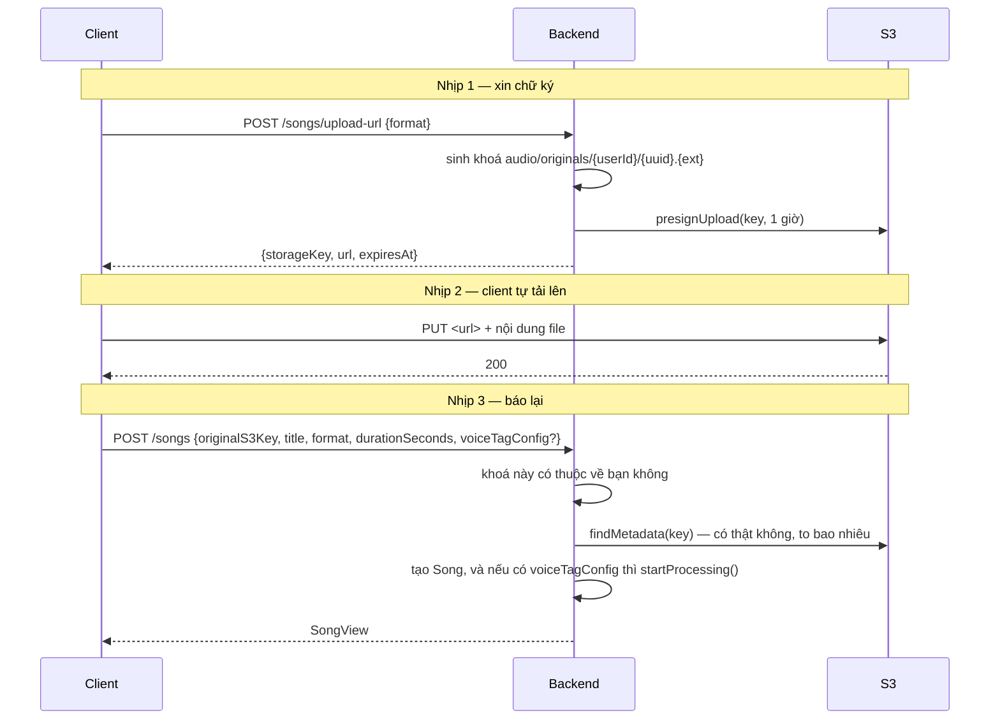

# Audio — Tải lên bài hát

> `POST /songs/upload-url` · `POST /songs` · `GET|PATCH|DELETE /songs/{id}` · `GET /songs`
> Bối cảnh: [Audio — Tour](audio-00-tour.md)

---

## 1. Bài toán

Một file nhạc nặng vài chục tới 200 MB. Nếu nó đi qua backend thì mỗi lần tải lên chiếm một luồng Tomcat suốt thời gian truyền, và băng thông server trả tiền hai lần — nhận vào rồi đẩy sang S3.

Cách tránh: **client tải thẳng lên S3**, backend chỉ cấp chữ ký.

Nhưng cách đó mở ra một khoảng trống tin cậy: backend **không bao giờ thấy file**. Nó chỉ nhận được một chuỗi khoá do client nói. Client có thể nói dối về khoá, về kích thước, hoặc về việc file có tồn tại hay không.

Toàn bộ phần thú vị của luồng này là cách bịt khoảng trống đó.

---

## 2. Luồng hai nhịp



Nhịp 1 **không có transaction và không ghi gì**. Nó chỉ là một phép tính chuỗi cộng một chữ ký. Client có thể xin URL rồi không dùng — không để lại dấu vết nào ngoài dòng log.

---

## 3. Bịt khoảng trống tin cậy

### 3.1. Khoá phải nằm dưới tiền tố của chính bạn

```java
/**
 * The client hands back the key it uploaded to, so it could just as easily hand back somebody else's.
 * Only keys under the caller's own prefix — with no traversal segments — are accepted.
 */
private void assertKeyBelongsToUser(UUID userId, String s3Key) {
    String expectedPrefix = ORIGINAL_KEY_ROOT + userId + "/";
    if (s3Key == null || !s3Key.startsWith(expectedPrefix) || s3Key.contains("..")) {
        throw new AudioBusinessException(AudioErrorCode.UNAUTHORIZED_ACCESS);
    }
}
```

Không có kiểm tra này, ai cũng gọi `POST /songs` với khoá của người khác và **tạo một bản ghi trỏ tới file người ta**. Từ đó `GET /songs/{id}/audio-url` sẽ ký URL cho phép tải bài hát đó về.

`contains("..")` chặn khoá kiểu `audio/originals/<myId>/../<yourId>/bai.mp3` — chuỗi này *bắt đầu* đúng tiền tố nhưng trỏ ra ngoài. Kiểm tiền tố suông là chưa đủ.

Chú ý cấu trúc khoá: `audio/originals/{userId}/{uuid}.{ext}`. **UUID ngẫu nhiên, không phải tên file người dùng đặt** — nên không có chuyện tên file lạ làm hỏng đường dẫn, và hai bài trùng tên không đè lên nhau.

### 3.2. S3 là nguồn sự thật về kích thước

```java
/**
 * Closes the other half of the trust gap: owning the key says nothing about what was put there. Storage
 * is the only authority on whether a file exists and how big it really is, so both come from there
 * rather than from the request.
 */
private StoredObject requireUploadedFile(String storageKey) {
    StoredObject uploaded = storagePort.findMetadata(storageKey)
            .orElseThrow(() -> new AudioBusinessException(AudioErrorCode.UPLOAD_NOT_FOUND));
    if (uploaded.sizeBytes() > uploadProperties.getMaxFileSizeBytes()) {
        throw new AudioBusinessException(AudioErrorCode.FILE_TOO_LARGE);
    }
    if (uploaded.sizeBytes() == 0) {
        throw new AudioBusinessException(AudioErrorCode.FILE_EMPTY);
    }
    return uploaded;
}
```

Ba điều được quyết định bởi S3, không bởi request: **file có tồn tại không**, **to bao nhiêu**, và có phải file rỗng không.

Trần 200 MB (`pwb.audio.upload.max-file-size-bytes`). Chú ý điểm yếu cố hữu của thiết kế này: **file đã nằm trên S3 rồi** mới bị từ chối. URL ký sẵn không mang giới hạn kích thước, nên một file 2 GB vẫn lên được bucket và chỉ bị chặn ở bước tạo bản ghi — rồi **nằm lại đó vĩnh viễn** vì không ai xoá. Xem mục 7.

### 3.3. Thứ duy nhất được tin từ client

`durationSeconds`. Nó được nhận thẳng vào `Song.create` mà không đo lại.

Không nguy hiểm — thời lượng sai chỉ làm hiển thị sai. Và ở bước xử lý, pipeline **đo lại bằng `ffprobe`** rồi ghi đè con số đúng ([audio-04](audio-04-pipeline-xu-ly.md)). Nên một bài đã xử lý luôn có thời lượng đúng; một bài chưa xử lý thì mang con số client khai.

---

## 4. Tạo bài hát: một lần ghi, không hai

```java
// Resolve the voice tag and flip the status before the insert so creation costs a single write.
VoiceTag voiceTag = null;
if (command.voiceTagConfig() != null) {
    voiceTag = voiceTagRepository.findByIdAndUserId(...)
            .orElseThrow(() -> new AudioBusinessException(AudioErrorCode.VOICE_TAG_NOT_FOUND));
    song.startProcessing();
}
Song saved = songRepository.save(song);
```

Trạng thái được đặt **trước** khi insert. Cách ngây thơ là lưu bài hát ở `UPLOADED`, rồi lưu cấu hình, rồi cập nhật trạng thái sang `PROCESSING` — ba lần ghi và một khoảnh khắc bài hát tồn tại ở trạng thái sai.

Kết quả: bài hát **sinh ra đã ở `PROCESSING`** nếu có voice tag, hoặc `UPLOADED` nếu không. Không có bước chuyển tiếp nào.

`findByIdAndUserId` cho voice tag là kiểm quyền sở hữu — không mượn được tag của người khác.

Sự kiện xử lý được đẩy qua **outbox**, không gửi thẳng Kafka:

```java
publishSongProcessingRequested(saved.getId(), command.userId());
```

Đây là `SongPersisted` → `voice.processing.v1` trong bảng outbox — đường B ở [bản đồ hệ thống](00-ban-do-he-thong.md).

---

## 5. Danh sách bài hát và bài toán N+1

```java
Set<UUID> taggedSongIds = songViewFactory.resolveTaggedSongIds(page.getContent());
return page.map(song -> songViewFactory.toView(song, taggedSongIds.contains(song.getId())));
```

Mỗi dòng trong danh sách cần biết "bài này có gắn voice tag không". Hỏi từng bài là **một truy vấn cho mỗi dòng** — 20 truy vấn cho một trang 20 bài.

`resolveTaggedSongIds` hỏi **một lần** cho cả trang, trả về tập id, rồi mỗi dòng chỉ tra tập trong bộ nhớ.

Danh sách cũng lọc được theo trạng thái (`statuses`), và có hai nhánh truy vấn tuỳ có lọc hay không.

---

## 6. Xoá: thứ tự có ý nghĩa

```java
songTagConfigRepository.deleteBySongId(song.getId());
songRepository.deleteById(song.getId());
storageCleaner.deleteAfterCommit(song.getOriginalS3Key(), song.getProcessedS3Key());
```

Cấu hình xoá trước bài hát (khoá ngoại), rồi **file mới bị xoá sau khi transaction commit**.

Thứ tự đó là bắt buộc. Xoá file trước rồi transaction rollback thì bản ghi vẫn còn mà file đã mất — hỏng hẳn. Xoá file sau commit thì trường hợp xấu nhất là bản ghi mất còn file ở lại: rác, nhưng vô hại.

Cùng nguyên tắc "thà rác còn hơn hỏng" như [iam-04 §3.1](iam-04-profile-va-avatar.md).

**Xoá cả hai khoá** — bản gốc và bản đã xử lý. Bản đã xử lý có thể null (bài chưa xử lý xong), và `StorageCleaner` tự lọc null.

Khác với IAM, xoá bài hát là **xoá cứng** — không có `deleted` flag. Migration `V202__hard_delete_songs.sql` cho thấy đây là một thay đổi có chủ ý: trước kia là xoá mềm.

---

## 7. Quyết định & đánh đổi

| Quyết định | Thay vì | Vì sao | Cái giá |
|---|---|---|---|
| Client tải thẳng lên S3 | Qua backend | Không tốn luồng Tomcat và băng thông server | Backend không thấy file → phải kiểm gián tiếp |
| Khoá do server sinh, UUID | Cho client đặt tên | Không đụng tên, không có ký tự lạ trong đường dẫn | Không đoán được khoá từ tên bài |
| Kiểm tiền tố **và** `..` | Chỉ kiểm tiền tố | Chặn được đường dẫn vượt cấp | — |
| Kích thước lấy từ S3 | Tin request | Client không khai gian được | Thêm một lời gọi S3 mỗi lần tạo bài |
| Tin `durationSeconds` của client | Đo bằng ffprobe ngay | Tạo bài hát không phải tải file về | Bài chưa xử lý có thể hiển thị sai thời lượng |
| Đặt trạng thái trước khi insert | Insert rồi update | Một lần ghi, không có khoảnh khắc trạng thái sai | Logic nhánh nằm trước lệnh lưu, đọc hơi ngược |
| URL tải lên sống 1 giờ | Ngắn hơn | Một file 200 MB trên mạng chậm cần thời gian | Cửa sổ dùng lại URL rộng 1 giờ |
| Xoá file sau commit | Trong transaction | Rollback không làm mất file | Bản ghi mất mà file còn → rác |
| Xoá cứng bài hát | Xoá mềm | File đã xoá thì giữ bản ghi cũng vô nghĩa | Không khôi phục được |
| Voice tag chỉ gắn lúc tạo | Cho gắn sau | Đường xử lý chỉ có một lối vào | **Không đổi được tag của bài đã tạo** |

---

## 8. Tự kiểm chứng

```bash
T=$(curl -s -X POST http://localhost:8080/api/v1/auth/login -H "Content-Type: application/json" -d '{"email":"pro1@gmail.com","password":"@NamHoang511"}' | grep -o '"accessToken":"[^"]*' | cut -d'"' -f4)
```

**Xin URL tải lên và xem hình dạng khoá:**

```bash
curl -s -X POST http://localhost:8080/api/v1/songs/upload-url -H "Authorization: Bearer $T" -H "Content-Type: application/json" -d '{"format":"mp3"}'
```

`storageKey` có dạng `audio/originals/<userId>/<uuid>.mp3`, `url` là URL S3 kèm chữ ký, `expiresAt` cách hiện tại 1 giờ.

**Thử khai khoá của người khác** — lấy URL như trên, đổi `userId` trong `storageKey` thành một UUID khác rồi gọi `POST /songs`. Nhận `AUDIO_012 UNAUTHORIZED_ACCESS`, và **không có truy vấn S3 nào** vì kiểm tiền tố chạy trước.

**Thử khai khoá đúng tiền tố nhưng chưa tải file lên** — dùng nguyên `storageKey` vừa xin mà bỏ qua bước `PUT`. Nhận `AUDIO_024 UPLOAD_NOT_FOUND`: đây là lúc S3 lên tiếng.

**Xem một dòng outbox sinh ra khi tạo bài có voice tag:**

```bash
docker exec -e PGPASSWORD="$(grep -E '^POSTGRES_PASSWORD=' .env | cut -d= -f2-)" pwb-postgres psql -U pwb_user -d pwb_db -c "SELECT event_type, topic, status, created_at FROM outbox_events WHERE event_type='SongPersisted' ORDER BY created_at DESC LIMIT 5;"
```

**Xem hai khoá của một bài đã xử lý:**

```bash
docker exec -e PGPASSWORD="$(grep -E '^POSTGRES_PASSWORD=' .env | cut -d= -f2-)" pwb-postgres psql -U pwb_user -d pwb_db -c "SELECT title, status, original_s3_key IS NOT NULL AS co_goc, processed_s3_key IS NOT NULL AS co_ban_dong_dau FROM audio_songs ORDER BY created_at DESC LIMIT 5;"
```

---

## 9. Giới hạn hiện tại

| Giới hạn | Chi tiết |
|---|---|
| **File bị từ chối vẫn nằm lại trên S3** | URL ký sẵn không giới hạn kích thước; một file quá to lên được bucket rồi bị `POST /songs` từ chối, và không ai xoá nó — mục 3.2 |
| URL ký sẵn xin xong không dùng cũng không ai biết | Không có bản ghi nào theo dõi khoá đã cấp |
| Không đổi được voice tag của bài đã tạo | Chỉ gắn được lúc tạo — [audio-03 §5](audio-03-cau-hinh-ghep-tag.md) |
| Không kiểm nội dung file thật sự là audio | Chỉ kiểm phần mở rộng và kích thước; file giả chỉ lộ ra khi `ffprobe` chạy ở bước xử lý, tức là sau khi đã tạo bản ghi |
| `durationSeconds` của bài chưa xử lý là do client khai | Mục 3.3 |
| Không giới hạn số bài hát mỗi người | Người dùng PRO tải lên bao nhiêu cũng được |
| `UPLOADED → PROCESSING` không có API | Sơ đồ trạng thái có mũi tên đó nhưng không đường nào đi tới |
