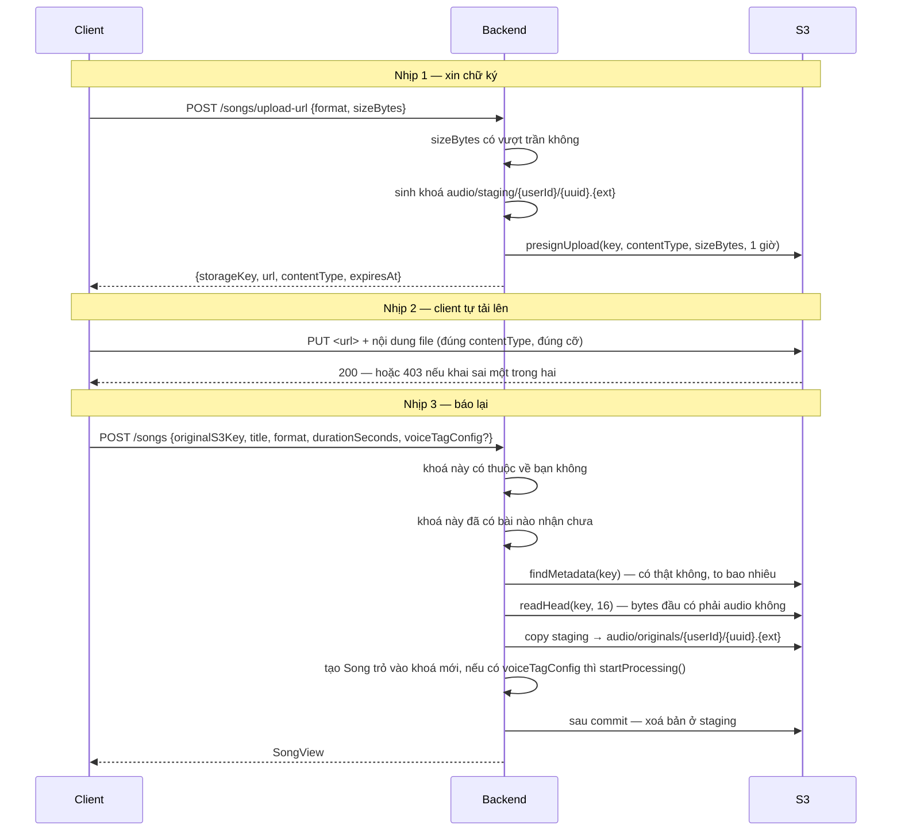

# Audio — Tải lên bài hát

> `POST /songs/upload-url` · `POST /songs` · `GET|PATCH|DELETE /songs/{id}` · `GET /songs`
> Bối cảnh: [Audio — Tour](audio-00-tour.md)

---

## 1. Bài toán

Một file nhạc nặng vài chục tới 200 MB. Nếu nó đi qua backend thì mỗi lần tải lên chiếm một luồng Tomcat suốt thời gian truyền, và băng thông server trả tiền hai lần — nhận vào rồi đẩy sang S3.

Cách tránh: **client tải thẳng lên S3**, backend chỉ cấp chữ ký.

Nhưng cách đó mở ra một khoảng trống tin cậy: backend **không bao giờ thấy file**. Nó chỉ nhận được một chuỗi khoá do client nói. Client có thể nói dối về khoá, về kích thước, hoặc về việc file có tồn tại hay không.

Toàn bộ phần thú vị của luồng này là cách bịt khoảng trống đó.

---

## 2. Luồng hai nhịp



Nhịp 1 **không có transaction và không ghi gì**. Nó chỉ là một phép tính chuỗi cộng một chữ ký. Client có thể xin URL rồi không dùng — không để lại dấu vết nào ngoài dòng log.

---

## 3. Bịt khoảng trống tin cậy

### 3.1. Khoá phải nằm dưới tiền tố của chính bạn

```java
/**
 * The client hands back the key it uploaded to, so it could just as easily hand back somebody else's.
 * Only keys under the caller's own prefix — with no traversal segments — are accepted.
 */
private void assertKeyBelongsToUser(UUID userId, String s3Key) {
    String expectedPrefix = STAGING_KEY_ROOT + userId + "/";
    if (s3Key == null || !s3Key.startsWith(expectedPrefix) || s3Key.contains("..")) {
        throw new AudioBusinessException(AudioErrorCode.UNAUTHORIZED_ACCESS);
    }
}
```

Không có kiểm tra này, ai cũng gọi `POST /songs` với khoá của người khác và **tạo một bản ghi trỏ tới file người ta**. Từ đó `GET /songs/{id}/audio-url` sẽ ký URL cho phép tải bài hát đó về.

`contains("..")` chặn khoá kiểu `audio/staging/<myId>/../<yourId>/bai.mp3` — chuỗi này *bắt đầu* đúng tiền tố nhưng trỏ ra ngoài. Kiểm tiền tố suông là chưa đủ.

Chú ý cấu trúc khoá: `audio/staging/{userId}/{uuid}.{ext}`. **UUID ngẫu nhiên, không phải tên file người dùng đặt** — nên không có chuyện tên file lạ làm hỏng đường dẫn, và hai bài trùng tên không đè lên nhau.

Giới hạn ở **tiền tố staging** cũng đóng luôn một đường khác: một khoá đã đăng ký nằm ở `audio/originals/`, nên không khai lại được để đăng ký lần hai.

### 3.1b. Đăng ký cũng là "chuyển nhà"

`POST /songs` không để tệp nằm nguyên chỗ nó được tải lên. Nó copy sang `audio/originals/{userId}/{uuid}.{ext}` (cùng chủ, cùng tên, khác tiền tố), ghi hàng trỏ vào khoá mới, rồi **sau khi commit** mới xoá bản ở staging.

Lý do không nằm ở luồng này mà ở chỗ dọn rác: chừng nào tệp bỏ dở và nhạc thật còn chung một tiền tố thì không lifecycle rule nào xoá được cái thứ nhất mà không đe doạ cái thứ hai. Tách ra rồi thì **mọi thứ còn lại trong `audio/staging/` chắc chắn là rác** — xem [cấu hình bucket](../storage/bucket-configuration.md).

Thứ tự có chủ ý ở cả hai đầu: copy **trước** khi ghi, để không có hàng nào trỏ vào đối tượng chưa tồn tại; xoá staging **sau** commit, để rollback trả tệp về đúng chỗ client đặt nó. Ghi hỏng thì bản copy bị thu hồi ngay — trừ khi hỏng vì đụng unique index, lúc đó bản copy là nhạc đang phát của người thắng cuộc đua chứ không phải của mình.

### 3.2. S3 là nguồn sự thật về kích thước

```java
/**
 * Closes the other half of the trust gap: owning the key says nothing about what was put there. Storage
 * is the only authority on whether a file exists and how big it really is, so both come from there
 * rather than from the request.
 */
private StoredObject requireUploadedFile(String storageKey) {
    StoredObject uploaded = storagePort.findMetadata(storageKey)
            .orElseThrow(() -> new AudioBusinessException(AudioErrorCode.UPLOAD_NOT_FOUND));
    if (uploaded.sizeBytes() > uploadProperties.getMaxFileSizeBytes()) {
        throw new AudioBusinessException(AudioErrorCode.FILE_TOO_LARGE);
    }
    if (uploaded.sizeBytes() == 0) {
        throw new AudioBusinessException(AudioErrorCode.FILE_EMPTY);
    }
    assertReallyAudio(storageKey);
    return uploaded;
}
```

Bốn điều được quyết định bởi S3, không bởi request: **file có tồn tại không**, **to bao nhiêu**, có phải file rỗng không, và **bytes đầu tiên có thật sự là audio không**.

Điều cuối là một lần đọc `Range: bytes=0-15` rồi đối chiếu magic bytes (`ID3`, `RIFF`, `fLaC`, `OggS`, hay frame sync MP3). Trước đó **không gì trong luồng này từng nhìn vào nội dung file**: phần mở rộng nằm trong khoá là do client chọn, `Content-Type` là header do client gửi — cả hai chỉ nói lên *người tải lên bảo rằng* đó là gì. Bài không gắn voice tag thì cũng không bao giờ được giải mã phía server, nên nếu không kiểm ở đây thì bytes tuỳ ý vẫn đăng ký được thành bài hát và phát lại cho người nghe.

Trần 200 MB (`pwb.audio.upload.max-file-size-bytes`) **được kiểm hai lần**, và lần quan trọng hơn nằm ở nhịp 1: `sizeBytes` client khai được ký thẳng vào URL, nên S3 từ chối một body khác cỡ **trước khi** nhận byte nào. Lần kiểm ở đây là lưới đỡ cho đối tượng ghi bằng URL cũ hoặc bằng đường khác. Trước khi có chữ ký đó, một file 2 GB vẫn lên được bucket và chỉ bị chặn lúc tạo bản ghi — rồi nằm lại vĩnh viễn.

### 3.3. Thứ duy nhất được tin từ client

`durationSeconds`. Nó được nhận thẳng vào `Song.create` mà không đo lại.

Không nguy hiểm — thời lượng sai chỉ làm hiển thị sai. Và ở bước xử lý, pipeline **đo lại bằng `ffprobe`** rồi ghi đè con số đúng ([audio-04](audio-04-pipeline-xu-ly.md)). Nên một bài đã xử lý luôn có thời lượng đúng; một bài chưa xử lý thì mang con số client khai.

---

## 4. Tạo bài hát: một lần ghi, không hai

```java
// Resolve the voice tag and flip the status before the insert so creation costs a single write.
VoiceTag voiceTag = null;
if (command.voiceTagConfig() != null) {
    voiceTag = voiceTagRepository.findByIdAndUserId(...)
            .orElseThrow(() -> new AudioBusinessException(AudioErrorCode.VOICE_TAG_NOT_FOUND));
    song.startProcessing();
}
Song saved = songRepository.save(song);
```

Trạng thái được đặt **trước** khi insert. Cách ngây thơ là lưu bài hát ở `UPLOADED`, rồi lưu cấu hình, rồi cập nhật trạng thái sang `PROCESSING` — ba lần ghi và một khoảnh khắc bài hát tồn tại ở trạng thái sai.

Kết quả: bài hát **sinh ra đã ở `PROCESSING`** nếu có voice tag, hoặc `UPLOADED` nếu không. Không có bước chuyển tiếp nào.

`findByIdAndUserId` cho voice tag là kiểm quyền sở hữu — không mượn được tag của người khác.

Sự kiện xử lý được đẩy qua **outbox**, không gửi thẳng Kafka:

```java
publishSongProcessingRequested(saved.getId(), command.userId());
```

Đây là `SongPersisted` → `voice.processing.v1` trong bảng outbox — đường B ở [bản đồ hệ thống](00-ban-do-he-thong.md).

---

## 5. Danh sách bài hát và bài toán N+1

```java
Set<UUID> taggedSongIds = songViewFactory.resolveTaggedSongIds(page.getContent());
return page.map(song -> songViewFactory.toView(song, taggedSongIds.contains(song.getId())));
```

Mỗi dòng trong danh sách cần biết "bài này có gắn voice tag không". Hỏi từng bài là **một truy vấn cho mỗi dòng** — 20 truy vấn cho một trang 20 bài.

`resolveTaggedSongIds` hỏi **một lần** cho cả trang, trả về tập id, rồi mỗi dòng chỉ tra tập trong bộ nhớ.

Danh sách cũng lọc được theo trạng thái (`statuses`), và có hai nhánh truy vấn tuỳ có lọc hay không.

---

## 6. Xoá: thứ tự có ý nghĩa

```java
songTagConfigRepository.deleteBySongId(song.getId());
songRepository.deleteById(song.getId());
storageCleaner.deleteAfterCommit(song.getOriginalS3Key(), song.getProcessedS3Key());
```

Cấu hình xoá trước bài hát (khoá ngoại), rồi **file mới bị xoá sau khi transaction commit**.

Thứ tự đó là bắt buộc. Xoá file trước rồi transaction rollback thì bản ghi vẫn còn mà file đã mất — hỏng hẳn. Xoá file sau commit thì trường hợp xấu nhất là bản ghi mất còn file ở lại: rác, nhưng vô hại.

Cùng nguyên tắc "thà rác còn hơn hỏng" như [iam-04 §3.1](iam-04-profile-va-avatar.md).

**Xoá cả hai khoá** — bản gốc và bản đã xử lý. Bản đã xử lý có thể null (bài chưa xử lý xong), và `StorageCleaner` tự lọc null.

Khác với IAM, xoá bài hát là **xoá cứng** — không có `deleted` flag. Migration `V202__hard_delete_songs.sql` cho thấy đây là một thay đổi có chủ ý: trước kia là xoá mềm.

---

## 7. Quyết định & đánh đổi

| Quyết định | Thay vì | Vì sao | Cái giá |
|---|---|---|---|
| Client tải thẳng lên S3 | Qua backend | Không tốn luồng Tomcat và băng thông server | Backend không thấy file → phải kiểm gián tiếp |
| Khoá do server sinh, UUID | Cho client đặt tên | Không đụng tên, không có ký tự lạ trong đường dẫn | Không đoán được khoá từ tên bài |
| Kiểm tiền tố **và** `..` | Chỉ kiểm tiền tố | Chặn được đường dẫn vượt cấp | — |
| Kích thước lấy từ S3 | Tin request | Client không khai gian được | Thêm một lời gọi S3 mỗi lần tạo bài |
| Tin `durationSeconds` của client | Đo bằng ffprobe ngay | Tạo bài hát không phải tải file về | Bài chưa xử lý có thể hiển thị sai thời lượng |
| Đặt trạng thái trước khi insert | Insert rồi update | Một lần ghi, không có khoảnh khắc trạng thái sai | Logic nhánh nằm trước lệnh lưu, đọc hơi ngược |
| URL tải lên sống 1 giờ | Ngắn hơn | Một file 200 MB trên mạng chậm cần thời gian | Cửa sổ dùng lại URL rộng 1 giờ |
| Xoá file sau commit | Trong transaction | Rollback không làm mất file | Bản ghi mất mà file còn → rác |
| Xoá cứng bài hát | Xoá mềm | File đã xoá thì giữ bản ghi cũng vô nghĩa | Không khôi phục được |
| Voice tag chỉ gắn lúc tạo | Cho gắn sau | Đường xử lý chỉ có một lối vào | **Không đổi được tag của bài đã tạo** |

---

## 8. Tự kiểm chứng

```bash
T=$(curl -s -X POST http://localhost:8080/api/v1/auth/login -H "Content-Type: application/json" -d '{"email":"user1@gmail.com","password":"@NamHoang511"}' | grep -o '"accessToken":"[^"]*' | cut -d'"' -f4)
```

**Xin URL tải lên và xem hình dạng khoá:**

```bash
curl -s -X POST http://localhost:8080/api/v1/songs/upload-url -H "Authorization: Bearer $T" -H "Content-Type: application/json" -d '{"format":"mp3","sizeBytes":4096}'
```

`storageKey` có dạng `audio/staging/<userId>/<uuid>.mp3`, `url` là URL S3 kèm chữ ký, `contentType` là `audio/mpeg`, `expiresAt` cách hiện tại 1 giờ. Trong phần query của `url` có `X-Amz-SignedHeaders=content-length;content-type;host` — hai header đó nằm trong chữ ký.

**Thử tải lên một file khác cỡ với cái đã khai** — dùng nguyên `url` vừa xin nhưng `PUT` một file không phải 4096 byte: S3 trả `403 SignatureDoesNotMatch`. Đổi `-H "Content-Type: text/html"` cũng vậy.

**Thử khai một kích thước vượt trần:**

```bash
curl -s -X POST http://localhost:8080/api/v1/songs/upload-url -H "Authorization: Bearer $T" -H "Content-Type: application/json" -d '{"format":"mp3","sizeBytes":999999999}'
```

`AUDIO_005 FILE_TOO_LARGE` — và chưa có URL nào được cấp, nên không có cách nào đưa file đó lên bucket.

**Thử đăng ký một file không phải audio** — xin URL, `PUT` lên 4096 byte văn bản thường, rồi gọi `POST /songs` với khoá đó. Nhận `AUDIO_014 INVALID_AUDIO_FILE`: `findMetadata` đã qua (file có thật, đúng cỡ), nhưng magic bytes không khớp container nào.

**Thử đăng ký hai lần cùng một khoá** — gọi `POST /songs` lần nữa với `originalS3Key` vừa dùng. Nhận `AUDIO_029 UPLOAD_ALREADY_REGISTERED`.

**Thấy tệp đã chuyển nhà** — sau khi đăng ký xong, so hai chỗ:

```bash
aws s3 ls "s3://<bucket>/audio/staging/<userId>/"    # không còn khoá vừa dùng
aws s3 ls "s3://<bucket>/audio/originals/<userId>/"  # khoá đó nằm ở đây
```

Và trong database, `original_s3_key` của bài vừa tạo bắt đầu bằng `audio/originals/` chứ không phải `audio/staging/`.

**Thử khai khoá của người khác** — lấy URL như trên, đổi `userId` trong `storageKey` thành một UUID khác rồi gọi `POST /songs`. Nhận `AUDIO_012 UNAUTHORIZED_ACCESS`, và **không có truy vấn S3 nào** vì kiểm tiền tố chạy trước.

**Thử khai khoá đúng tiền tố nhưng chưa tải file lên** — dùng nguyên `storageKey` vừa xin mà bỏ qua bước `PUT`. Nhận `AUDIO_024 UPLOAD_NOT_FOUND`: đây là lúc S3 lên tiếng.

**Xem một dòng outbox sinh ra khi tạo bài có voice tag:**

```bash
docker exec -e PGPASSWORD="$(grep -E '^POSTGRES_PASSWORD=' .env | cut -d= -f2-)" pwb-postgres psql -U pwb_user -d pwb_db -c "SELECT event_type, topic, status, created_at FROM outbox_events WHERE event_type='SongPersisted' ORDER BY created_at DESC LIMIT 5;"
```

**Xem hai khoá của một bài đã xử lý:**

```bash
docker exec -e PGPASSWORD="$(grep -E '^POSTGRES_PASSWORD=' .env | cut -d= -f2-)" pwb-postgres psql -U pwb_user -d pwb_db -c "SELECT title, status, original_s3_key IS NOT NULL AS co_goc, processed_s3_key IS NOT NULL AS co_ban_dong_dau FROM audio_songs ORDER BY created_at DESC LIMIT 5;"
```

---

## 9. Giới hạn hiện tại

| Giới hạn | Chi tiết |
|---|---|
| **File tải lên rồi không đăng ký thì nằm lại vĩnh viễn** | Không bản ghi nào theo dõi khoá đã cấp, nên không code nào tìm lại được; chỉ lifecycle rule của bucket dọn được — [cấu hình bucket](../storage/bucket-configuration.md) |
| Không đổi được voice tag của bài đã tạo | Chỉ gắn được lúc tạo — [audio-03 §5](audio-03-cau-hinh-ghep-tag.md) |
| Kiểm nội dung chỉ đọc 16 byte đầu | Đủ để loại file không phải audio, nhưng không chứng minh file giải mã được — một MP3 cụt đầu đúng magic vẫn qua, và chỉ hỏng khi `ffprobe` chạy |
| `durationSeconds` của bài chưa xử lý là do client khai | Mục 3.3 |
| Không giới hạn số bài hát mỗi người | Tài khoản nào tải lên bao nhiêu cũng được |
| `UPLOADED → PROCESSING` không có API | Sơ đồ trạng thái có mũi tên đó nhưng không đường nào đi tới |
