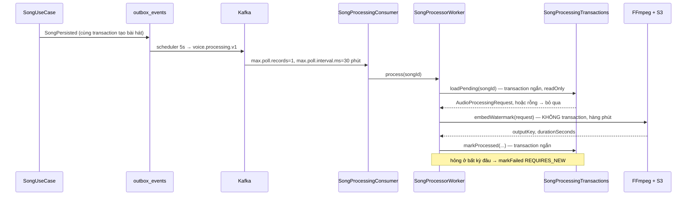

# Audio — Pipeline xử lý watermark

> Kafka `voice.processing.v1` → `SongProcessingConsumer` → `SongProcessorWorker` → `JaffreeAudioProcessorAdapter` → FFmpeg
> `POST /songs/{id}/retry-processing`
> Bối cảnh: [Audio — Tour](audio-00-tour.md) · Tham số đầu vào: [audio-03](audio-03-cau-hinh-ghep-tag.md)

---

## 1. Bài toán

Ghép voice tag vào bài hát nghĩa là: tải hai file từ S3 về đĩa, chạy FFmpeg, tải kết quả lên. Với một bài 5 phút thì việc này mất **hàng chục giây tới vài phút**.

Con số đó phá vỡ mọi giả định của một request HTTP thông thường, và kéo theo bảy vấn đề phải giải:

1. Không thể để người dùng ngồi chờ → phải bất đồng bộ
2. Không thể giữ connection database → không transaction
3. Kafka sẽ tưởng consumer chết → phải nới thời gian
4. FFmpeg có thể treo vĩnh viễn → phải có đồng hồ đếm ngược
5. File tạm nằm trên đĩa thật → phải kiểm chỗ trống và dọn dẹp
6. Ghi nhận thất bại lại bị rollback cuốn theo → phải tách transaction
7. Cùng một bài có thể bị xử lý hai lần → phải chống trùng

File này đi qua cả bảy.

---

## 2. Toàn cảnh



Ba tầng, mỗi tầng một trách nhiệm rạch ròi:

| Tầng | Trách nhiệm | Transaction |
|---|---|---|
| `SongProcessingConsumer` | Nói chuyện với Kafka | không |
| `SongProcessorWorker` | Điều phối, xử lý thất bại | **cố ý không** |
| `SongProcessingTransactions` | Mọi lần chạm database | ba transaction ngắn |
| `JaffreeAudioProcessorAdapter` | Đĩa và FFmpeg | không |

Việc tách `SongProcessingTransactions` thành một class riêng là điều kiện để tầng trên nó không có transaction: nếu các phương thức đó nằm ngay trong worker thì Spring gọi nội bộ trong cùng một bean và **`@Transactional` không có tác dụng** (proxy bị bỏ qua).

---

## 3. Vấn đề Kafka: consumer bị coi là đã chết

```java
/**
 * Merging a watermark holds this thread for as long as FFmpeg runs, which for a long track is minutes.
 * Kafka reads a listener that has not polled within {@code max.poll.interval.ms} as dead and hands the
 * partition to somebody else — the song would then be merged twice, and the second run would fight the
 * first for CPU. The window is widened past the processor's own timeout, and a poll brings back a single
 * record so the clock covers one merge rather than a whole batch of them.
 */
@KafkaListener(
        topics = "…voice.processing.v1",
        properties = {
                "max.poll.records=1",
                "max.poll.interval.ms=…1800000"
        }
)
```

Đây là cái bẫy kinh điển khi dùng Kafka cho việc chạy lâu, và cách chữa gồm **hai** phần phải đi cùng nhau:

**`max.poll.interval.ms = 30 phút`** — dài hơn hẳn trần 15 phút của FFmpeg. Nếu để mặc định (5 phút), một bài hát dài sẽ khiến Kafka kết luận consumer đã chết, chia lại partition, và **bài hát được xử lý lần thứ hai** trong khi lần thứ nhất vẫn đang chạy. Hai tiến trình FFmpeg tranh CPU của nhau.

**`max.poll.records = 1`** — mỗi lần lấy về đúng một bản ghi. Không có nó, một lần poll mang về 500 bài, và đồng hồ 30 phút phải bao hết cả 500 lần render thay vì một.

Hai tham số này chỉ có nghĩa khi đi cùng: nới đồng hồ mà vẫn lấy về cả lô thì đồng hồ vẫn không đủ.

---

## 4. Bên trong FFmpeg: bốn bước và một phép đo

```java
workspace.assertSpaceAvailable(estimateScratchBytes(request));   // 0 · còn đĩa không
Path jobDir = workspace.createJobDirectory(request.songId());
try {
    Path inputFile    = download(request.inputKey(),    jobDir.resolve("input"));
    Path voiceTagFile = download(request.voiceTagKey(), jobDir.resolve("voice-tag"));
    double songDuration     = requireDuration(inputFile, "song");        // 1 · ffprobe
    double voiceTagDuration = requireDuration(voiceTagFile, "voice tag");
    assertIntervalFitsTag(request, voiceTagDuration);
    double tagMatchGainDb = measureTagMatchGain(inputFile, voiceTagFile, …);  // 2 · ebur128
    String filterComplex = WatermarkFilterBuilder.build(request, songDuration, voiceTagDuration, tagMatchGainDb);
    log.debug("FFmpeg filter for songId={}: {}", request.songId(), filterComplex);
    …render…                                                              // 3 · libmp3lame
    storagePort.uploadFromPath(request.outputKey(), outputFile, fileSize); // 4
} finally {
    workspace.release(jobDir);                                            // luôn dọn
}
```

### 4.1. Cân độ to — phần hay nhất của module

Bài toán này không hiển nhiên chút nào, và class `TagLoudnessMatch` mô tả nó rất rõ:

> *Mixing both at their recorded levels is what made a tag at 100% volume sound tiny. A mastered track lands around **-9 to -12 LUFS**; a voice tag — synthesized, or recorded on whatever the user had — lands around **-20 to -27**. That gap is 10 to 15 dB, and 10 dB is roughly half as loud to the ear, so the slider ran out of travel long before the tag was audible: 100% means "unchanged", never "as loud as the song".*

Nói cách khác: **thanh trượt âm lượng đã từng vô dụng.** Kéo lên 100% vẫn không nghe thấy tag, vì 100% nghĩa là "giữ nguyên mức thu", mà mức thu của một giọng đọc thấp hơn nhạc đã master tới 15 dB.

Cách chữa: đo độ to tích hợp (LUFS) của cả hai bằng bộ lọc `ebur128` của FFmpeg, rồi tính gain đưa tag lên ngang nhạc cộng thêm một khoảng dôi:

```java
double gain = (songLufs + headroomDb) - tagLufs;
return Math.max(MAX_CUT_DB, Math.min(MAX_BOOST_DB, gain));
```

`headroomDb` mặc định **3.0** (`pwb.audio.processor.voice-tag-headroom-db`) — tag nằm cao hơn nhạc 3 dB để nổi lên trên.

Ba lớp bảo vệ quanh phép tính:

| Chặn | Giá trị | Vì sao |
|---|---|---|
| `MAX_BOOST_DB` | **+18** | *"A tag quiet enough to need more than this is mostly noise floor, and lifting it further just makes the hiss audible"* |
| `MAX_CUT_DB` | **−12** | Tag to hơn thế thì thanh trượt của người dùng là công cụ đúng hơn |
| `IMPLAUSIBLY_QUIET_LUFS` | **−60** | File gần như im lặng cho ra con số đòi hỏi một mức boost vô lý |

Đo hỏng hoặc giá trị vô lý → trả `0.0`, tức là quay về hành vi cũ (không cân). **Hỏng thì thoái lui, không sập.**

Kết quả cuối cùng: thanh trượt của người dùng giờ làm đúng việc nhãn của nó hứa — *chỉnh tag so với nhạc, từ một điểm xuất phát mà nó đã nghe được rồi.*

### 4.2. Đồng hồ đếm ngược cho FFmpeg

```java
/**
 * Waits for the render, but not forever. {@code execute()} blocks with no way out, so an FFmpeg that
 * stalls — a corrupt input it never stops reading, a filter that produces nothing — used to pin this
 * thread for the life of the process. The consumer runs one song at a time, so that one stuck song
 * stopped every song behind it, and {@code timeout-minutes} was configuration that did nothing.
 */
render.get(timeoutMinutes(), TimeUnit.MINUTES);
```

Câu cuối là điều đáng nhớ: **`timeout-minutes` từng là cấu hình không làm gì cả.** Nó tồn tại trong properties, đọc lên được, nhưng code dùng `execute()` chặn vô hạn nên con số ấy chưa bao giờ được dùng. Chuyển sang `executeAsync()` + `get(timeout)` mới làm nó có thật.

Hậu quả của bug cũ nghiêm trọng hơn vẻ ngoài: consumer chạy **một bài một lúc**, nên một bài treo là **cả hàng đợi đứng im vĩnh viễn**.

`abort()` sau khi hết giờ cũng có hai chi tiết đáng đọc:

- Phải **chờ tiến trình thật sự biến mất**, vì trên Windows một FFmpeg còn sống vẫn giữ file output mở và thư mục job không xoá được.
- Cả `forceStop()` lẫn `get()` sau đó đều được bọc `try`, vì `forceStop` ném `CancellationException` khi nó thắng cuộc đua với tiến trình đang kết thúc. Không lỗi nào trong hai lỗi đó nói được điều gì hữu ích — *"the timeout that got us here is already the answer"*.

### 4.3. Không đo lại file vừa ghi

```java
// The mix is cut to the song (amix duration=first), so the song's duration is the output's.
// Probing the file we just wrote would spawn a third ffprobe to re-read it for an answer
// already in hand.
int duration = (int) songDuration;
```

Đồ thị lọc dùng `duration=first` ([audio-03 §3.4](audio-03-cau-hinh-ghep-tag.md)), nên độ dài đầu ra **bằng đúng** độ dài bài hát đã đo ở bước 1. Chạy ffprobe lần thứ ba chỉ để hỏi lại câu đã biết.

Đây cũng là chỗ **thời lượng do client khai bị ghi đè bằng số đo thật** ([audio-01 §3.3](audio-01-tai-len-bai-hat.md)).

### 4.4. Kiểm đầu ra rỗng

```java
if (!Files.exists(outputFile) || Files.size(outputFile) == 0) {
    throw new AudioBusinessException(AudioErrorCode.FFMPEG_EMPTY_OUTPUT);
}
```

FFmpeg có thể **thoát với mã 0 mà không viết gì** — một đồ thị lọc sai cú pháp tinh vi vẫn chạy "thành công". Không kiểm thì một file 0 byte được tải lên S3 và bài hát được đánh dấu `PROCESSED`. Người dùng bấm nghe và nhận về im lặng.

---

## 5. Đĩa: chỗ duy nhất trong hệ thống dùng tài nguyên máy chủ thật

`AudioWorkspace` quản lý thư mục làm việc (`./tmp/pwb-audio` mặc định) với ba nhiệm vụ:

**Kiểm chỗ trống trước khi bắt đầu** — `assertSpaceAvailable(estimateScratchBytes(request))` → `AUDIO_023 INSUFFICIENT_DISK_SPACE`. Hết đĩa giữa chừng thì mất công tải hai file về rồi mới hỏng.

**Một thư mục cho mỗi job**, đặt theo `songId`, xoá trong khối `finally`. Kể cả khi FFmpeg treo và bị giết, khối `finally` vẫn chạy.

**Quét thư mục mồ côi lúc khởi động** — `orphan-retention-hours: 6`. Tiến trình bị `kill -9` giữa chừng để lại thư mục không ai dọn; lần khởi động sau sẽ dọn hộ. Đây là lưới an toàn cho trường hợp `finally` không kịp chạy.

| Cấu hình | Mặc định |
|---|---|
| `working-dir` | `./tmp/pwb-audio` |
| `cleanup-temp-files` | `true` |
| `orphan-retention-hours` | `6` |
| `timeout-minutes` | `15` |
| `output-bitrate` | `192k` |
| `voice-tag-headroom-db` | `3.0` |
| `ffmpeg-dir` | rỗng — tìm trong `PATH` |

---

## 6. Ba transaction ngắn, và một cái đặc biệt

### 6.1. `loadPending` — cửa chống trùng thứ nhất

```java
if (song.getStatus() != SongStatus.PROCESSING) {
    return Optional.empty();
}
```

Bài hát không còn ở `PROCESSING` thì **bỏ qua im lặng**, worker chỉ ghi log `info`. Điều này xử lý được cả ba tình huống: sự kiện bị giao lại, bài hát đã xử lý xong, hoặc bài hát đã bị xoá.

Cấu hình bị tắt (`enabled = false`) cũng dừng ở đây.

### 6.2. `markProcessed` — cửa chống trùng thứ hai

```java
if (song.isProcessed()) {
    log.debug("Ignoring duplicate processing result: songId={}", songId);
    return;
}
```

Kiểm lại một lần nữa **sau khi** FFmpeg xong. Cần thiết vì giữa `loadPending` và `markProcessed` có vài phút, đủ để một tiến trình khác hoàn thành trước.

Bài hát biến mất trong lúc render cũng được xử lý riêng — log `warn` *"Song vanished before its result could be stored"* rồi trả về, không ném.

Hai cửa này là cách một pipeline **at-least-once** cư xử như **at-most-once** ở phần có tác dụng phụ lên database. Nhưng chú ý: **file trên S3 vẫn được tải lên hai lần** nếu chạy trùng — cửa thứ hai chặn ở database, không chặn ở lưu trữ.

### 6.3. `markFailed` — lại là `REQUIRES_NEW`

```java
@Transactional(propagation = Propagation.REQUIRES_NEW)
public void markFailed(UUID songId, String error) { … }
```

Cùng bẫy như OTP ở [iam-01 §6](iam-01-dang-ky-va-otp.md): thất bại làm rollback, và bản ghi thất bại bị cuốn theo. `REQUIRES_NEW` commit riêng.

Ở đây nó còn cần vì lý do thứ hai: `markFailed` được gọi từ khối `catch`, và worker sau đó **ném lại** exception để Kafka biết mà xử lý theo cơ chế retry/DLT.

Worker cũng cẩn thận không để việc ghi thất bại che mất lỗi gốc:

```java
/**
 * Recording the failure must never replace the original one in the stack trace, so it swallows its own.
 */
private void recordFailure(UUID songId, RuntimeException cause) {
    try {
        transactions.markFailed(songId, describe(cause));
    } catch (RuntimeException ex) {
        log.error("Could not record processing failure: songId={}", songId, ex);
    }
}
```

---

## 7. Chạy lại

```java
/**
 * A failed merge produced no audio, so there is nothing to supersede and nothing to clean up — this
 * re-runs the first render rather than replacing a finished one.
 */
public SongView retryProcessing(UUID userId, UUID songId) {
    Song song = requireOwnedSong(userId, songId);
    try {
        song.retryProcessing();
    } catch (Song.ProcessingStateException ex) {
        throw new AudioBusinessException(AudioErrorCode.RETRY_NOT_ALLOWED);
    }
    …publishSongProcessingRequested(saved.getId(), userId);
}
```

**Chỉ bài `FAILED` mới chạy lại được** (`AUDIO_026` nếu không phải). Quy tắc nằm trong domain model (`Song.retryProcessing` ném `ProcessingStateException`), không nằm trong use case — use case chỉ dịch nó sang mã lỗi.

Lý do quy tắc chặt như vậy nằm trong comment: một lần ghép hỏng **không tạo ra file nào**, nên chạy lại là chạy lần đầu, không phải thay thế. Cho phép chạy lại một bài đã `PROCESSED` sẽ tạo ra một khoá đầu ra mới và **bỏ rơi khoá cũ** — cần thêm logic dọn dẹp mà hiện không có.

`retry-processing` **không đổi được cấu hình**. Nó chạy lại đúng tham số cũ. Nên nó chữa được lỗi hạ tầng (hết đĩa, S3 chập, FFmpeg quá giờ), nhưng **không chữa được lỗi tham số** như `interval` ngắn hơn tag ([audio-03 §2.2](audio-03-cau-hinh-ghep-tag.md)) — chạy lại sẽ hỏng y hệt.

---

## 8. Quyết định & đánh đổi

| Quyết định | Thay vì | Vì sao | Cái giá |
|---|---|---|---|
| Bất đồng bộ qua Kafka | Xử lý ngay trong request | Người dùng không chờ vài phút | Phải có trạng thái, phải có retry, phải chống trùng |
| Sự kiện đi qua outbox | Gửi thẳng Kafka | Rollback không để lại sự kiện ma | Trễ tới 5 giây |
| `max.poll.interval.ms = 30 phút` + `max.poll.records = 1` | Mặc định | Kafka không tưởng consumer đã chết | Consumer chậm thật cũng không bị phát hiện trong 30 phút |
| Tách `SongProcessingTransactions` | Để `@Transactional` trong worker | Gọi nội bộ cùng bean thì proxy bị bỏ qua, annotation vô hiệu | Thêm một class |
| Ba transaction ngắn | Một transaction bao cả | Không giữ connection qua FFmpeg | Mất tính nguyên tử; cần hai cửa chống trùng |
| Cân độ to bằng `ebur128` | Chỉ dùng phần trăm người dùng chọn | Thanh trượt mới có ý nghĩa | Thêm hai lượt phân tích trước khi render |
| Kẹp gain ở +18/−12 dB | Cân chính xác tuyệt đối | Không khuếch đại nền nhiễu | Tag rất nhỏ vẫn không lên đủ to |
| Đo hỏng → gain 0 | Ném lỗi | Thoái lui về hành vi cũ vẫn dùng được | Kết quả tệ hơn mà không ai biết vì sao |
| `executeAsync` + timeout | `execute()` chặn | Một bài treo không chặn cả hàng đợi | Phải tự viết `abort` và xử lý cuộc đua |
| Không đo lại file đầu ra | ffprobe lần ba | Đã biết câu trả lời | Phụ thuộc vào việc `duration=first` không đổi |
| Kiểm file rỗng | Tin mã thoát 0 | FFmpeg thoát 0 mà không viết gì là có thật | — |
| Chỉ `FAILED` mới retry | Cho retry mọi trạng thái | Không bỏ rơi khoá đầu ra cũ | Không có cách render lại một bài đã xong |
| Một bài một lúc | Chạy song song | FFmpeg ăn CPU, chạy song song thì cùng chậm | Hàng đợi dài thì chờ lâu |

---

## 9. Tự kiểm chứng

**Xem trạng thái và thời gian xử lý:**

```bash
docker exec -e PGPASSWORD="$(grep -E '^POSTGRES_PASSWORD=' .env | cut -d= -f2-)" pwb-postgres psql -U pwb_user -d pwb_db -c "SELECT title, duration_seconds, status, updated_at - created_at AS mat_bao_lau, left(coalesce(last_error,'-'),40) FROM audio_songs ORDER BY created_at DESC LIMIT 5;"
```

> Chụp thật: một bài 125 giây, `PROCESSED`, mất **~3 giây**.

**Nhìn thấy đồ thị lọc** — bật log debug rồi tạo một bài có voice tag:

```bash
docker exec -e PGPASSWORD="$(grep -E '^POSTGRES_PASSWORD=' .env | cut -d= -f2-)" pwb-postgres psql -U pwb_user -d pwb_db -c "SELECT event_type, topic, status FROM outbox_events WHERE topic='voice.processing.v1' ORDER BY created_at DESC LIMIT 3;"
```

Trong log backend tìm `FFmpeg filter for songId=` — chuỗi in ra chứa cả gain cân độ to (`volume=…dB`) lẫn âm lượng người dùng (`volume=0.xxx`), đúng như mục 4.1 và [audio-03 §3.2](audio-03-cau-hinh-ghep-tag.md) mô tả.

**Xem thư mục làm việc trong lúc chạy:**

```bash
ls -la Backend/tmp/pwb-audio 2>/dev/null
```

Có thư mục tên theo `songId` nghĩa là đang render; sau khi xong phải rỗng.

**Xem hàng đợi và hàng chết:**

```bash
docker exec pwb-kafka kafka-consumer-groups --bootstrap-server localhost:9092 --describe --group audio-song-processor
```

Cột `LAG` cho biết còn bao nhiêu bài đang chờ.

**Ép một lần thất bại** — tạo bài hát với `intervalSeconds` nhỏ hơn thời lượng voice tag. Bài chuyển `PROCESSING` rồi `FAILED` với `last_error` chứa `AUDIO_022`. Sau đó gọi `retry-processing`: nó chạy lại và **hỏng đúng như vậy**, chứng minh retry không chữa được lỗi tham số (mục 7).

**Thử retry một bài đã xong** — nhận `AUDIO_026 RETRY_NOT_ALLOWED`.

---

## 10. Giới hạn hiện tại

| Giới hạn | Chi tiết |
|---|---|
| **Một bài một lúc, một instance** | `max.poll.records=1` và consumer đơn; hàng đợi dài là chờ tuần tự. Nhân bản instance thì có nhiều worker, nhưng cả hệ thống hiện chỉ chạy được một instance ([13 §10](13-realtime-stomp.md)) |
| Chạy trùng vẫn tải file lên S3 hai lần | Cửa chống trùng chỉ chặn ở database — mục 6.2 |
| Retry không đổi được tham số | Lỗi cấu hình thì retry bao nhiêu lần cũng hỏng — mục 7 |
| Không render lại được bài đã xong | Muốn đổi voice tag phải tải lại bài hát từ đầu — [audio-03 §5](audio-03-cau-hinh-ghep-tag.md) |
| Không có tiến độ | Người dùng chỉ thấy `PROCESSING` cho tới khi xong; không biết còn bao lâu |
| Không có thông báo khi xong | Không email, không sự kiện realtime — client phải tự hỏi lại |
| `last_error` là tên class + message | Đủ để chẩn đoán thô, không đủ để hiển thị cho người dùng |
| Đĩa là tài nguyên chia sẻ không giới hạn | Kiểm chỗ trống trước mỗi job, nhưng không có hạn ngạch; nhiều job lớn liên tiếp vẫn lấp đầy đĩa |
| FFmpeg phải có sẵn trên máy | `ffmpeg-dir` rỗng nghĩa là tìm trong `PATH`; thiếu thì mọi lần xử lý đều hỏng, và chỉ lộ khi có bài hát đầu tiên |
