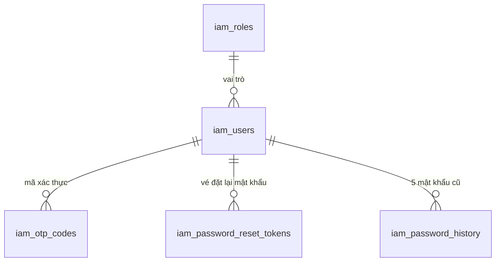
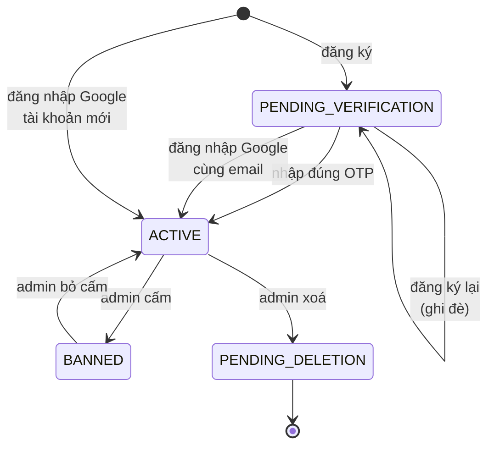

# IAM — Tour

> **File này để hiểu module IAM như một câu chuyện**, không phải tra cứu từng chức năng. Nó đi theo vòng đời một tài khoản từ lúc chưa tồn tại tới lúc bị xoá, và chỉ ra chỗ nào đọc tiếp.
> Chi tiết: [đăng ký & OTP](iam-01-dang-ky-va-otp.md) · [mật khẩu](iam-02-mat-khau.md) · [Google](iam-03-google-oauth.md) · [hồ sơ & ảnh đại diện](iam-04-profile-va-avatar.md) · [quản trị](iam-05-quan-tri-nguoi-dung.md) · [tìm kiếm](iam-06-tim-kiem-nguoi-dung.md)
> Đăng nhập/refresh đã có file riêng đi rất sâu: [02 — Lát cắt dọc](02-lat-cat-doc-dang-nhap.md).

---

## 1. IAM giữ cái gì

Năm bảng, và mối quan hệ giữa chúng nói gần hết câu chuyện:



`iam_users` là trung tâm. Ba bảng còn lại đều là **thứ tạm thời gắn vào một user**: mã OTP hết hạn sau 10 phút, vé đặt lại mật khẩu hết hạn sau 30 phút, lịch sử mật khẩu giữ tối đa 5 bản.

Ngoài Postgres, IAM còn giữ trạng thái ở **Redis** — phiên đăng nhập, bộ đếm, khoá tạm. Đó là nơi duy nhất biết "ai đang đăng nhập". Chi tiết ở [02 §5](02-lat-cat-doc-dang-nhap.md).

---

## 2. Vòng đời một tài khoản



Bốn trạng thái, và mỗi mũi tên là một chức năng. Đọc sơ đồ này là biết IAM có những gì.

Ba điều đáng chú ý ngay:

- **Không có mũi tên nào từ `PENDING_DELETION` quay lại.** Xoá là xoá mềm (`deleted = true`), nhưng không có API khôi phục.
- **Google có hai đường vào `ACTIVE`**, một trong đó bỏ qua hoàn toàn OTP — vì Google đã xác nhận email hộ.
- **`PENDING_VERIFICATION` tự ghi đè được.** Đăng ký lại một email chưa xác thực không báo lỗi trùng, nó thay thế bản ghi cũ. Lý do ở [iam-01 §3](iam-01-dang-ky-va-otp.md).

---

## 3. Câu chuyện, theo thứ tự xảy ra

### Chặng 1 — Trở thành người dùng

`POST /auth/register` tạo một `User` ở `PENDING_VERIFICATION`, sinh mã 6 số, **lưu bản băm của mã** rồi đẩy email vào outbox. Người dùng nhập mã ở `POST /auth/verify-otp`; đúng thì tài khoản chuyển `ACTIVE` **và được cấp token luôn** — không phải đăng nhập lại.

Đường thay thế: `POST /auth/google-login`. Không OTP, không mật khẩu.

→ [iam-01 — Đăng ký & OTP](iam-01-dang-ky-va-otp.md), [iam-03 — Google](iam-03-google-oauth.md)

### Chặng 2 — Ra vào hằng ngày

`login` → access token 15 phút + refresh token 14 ngày trong cookie. `refresh` xoay token mỗi lần gọi và phát hiện được token bị đánh cắp. `logout` thu hồi.

→ [02 — Lát cắt dọc đăng nhập](02-lat-cat-doc-dang-nhap.md) *(file đi sâu nhất trong cả bộ tài liệu)*

### Chặng 3 — Quên và đổi mật khẩu

Ba đường tới cùng một đích:

| Đường | Xác minh bằng | Ai gọi được |
|---|---|---|
| `forgot-password` → `reset-password` | Vé gửi qua email, sống 30 phút | Bất kỳ ai (public) |
| `change-password` | Mật khẩu hiện tại | Người đã đăng nhập |
| — | | Tài khoản Google **không dùng được cả hai** |

Cả hai đường đều đi qua đúng bốn bước giống nhau: kiểm chính sách → kiểm không trùng 5 mật khẩu cũ → đổi → **thu hồi mọi phiên**.

→ [iam-02 — Mật khẩu](iam-02-mat-khau.md)

### Chặng 4 — Hồ sơ

Xem, đổi tên, đổi ảnh đại diện. Ảnh nằm trên S3; database chỉ giữ **khoá lưu trữ**, và mỗi lần đọc hồ sơ thì ký một URL tạm 15 phút.

→ [iam-04 — Hồ sơ & ảnh đại diện](iam-04-profile-va-avatar.md)

### Chặng 5 — Bị quản trị viên động vào

Cấm, bỏ cấm, đổi vai trò, xoá. Ba trong bốn thao tác đó **thu hồi mọi phiên** của người bị tác động.

→ [iam-05 — Quản trị](iam-05-quan-tri-nguoi-dung.md)

### Xuyên suốt — Tìm kiếm

Tìm kiếm và gợi ý phía admin chạy thẳng trên Postgres bằng một truy vấn JPA Specification. Từng chạy trên Elasticsearch; phần đó gỡ ngày 2026-08-10 và mất theo bỏ dấu, khớp gần đúng lẫn xếp hạng.

→ [iam-06 — Tìm kiếm](iam-06-tim-kiem-nguoi-dung.md)

---

## 4. Sáu khuôn mẫu lặp lại khắp module

Nhận ra sáu khuôn này thì đọc bất kỳ use case nào của IAM cũng thấy quen. Đây là phần đáng nhớ nhất của tour.

### 4.1. Không bao giờ để lộ email nào có tồn tại

Xuất hiện ở **ba** chỗ, mỗi chỗ một kiểu:

| Chỗ | Cách giấu |
|---|---|
| `login` | Email lạ và sai mật khẩu **cùng** ném `IAM_004`; trạng thái tài khoản chỉ được kiểm **sau khi** mật khẩu đúng |
| `forgot-password` | Luôn trả cùng một câu, dù email không tồn tại / bị khoá / là tài khoản Google. Không echo `userId` |
| `register` | Email đã đăng ký và đã xác thực thì báo `EMAIL_ALREADY_REGISTERED` — **đây là chỗ duy nhất cố tình rò rỉ**, vì không báo thì người dùng thật không hiểu vì sao không đăng ký được |

### 4.2. Hai tầng chống lạm dụng, không phải một

| | Rate limit | Cooldown |
|---|---|---|
| Câu hỏi | "Bao nhiêu lần mỗi phút?" | "Đã đủ lâu kể từ lần trước chưa?" |
| Cài đặt | Script Lua `INCR`+`EXPIRE` nguyên tử | `SETNX` với TTL |
| Dùng cho | `login` 10 · `refresh` 30 · `verify-otp` 10 · `reset-password` 5 · `change-password` 5 · `google-login` 10 (mỗi phút) | `register` 60s · `resend-otp` 60s · `password-reset` 60s |
| Vượt thì | `IAM_014` | `IAM_026`, kèm `retryAfterSeconds` |

Cộng thêm tầng thứ ba chỉ dành cho đăng nhập: **khoá tài khoản** sau 5 lần sai (15 phút) hoặc 20 lần sai từ một IP (30 phút).

Và tầng thứ tư nằm ngoài IAM: `HttpRateLimitFilter` đếm 500 request/phút cho mọi endpoint ([01 §5.1](01-architecture-overview.md)).

### 4.3. Bí mật thì băm, không lưu thô

**Không thứ gì nhạy cảm được lưu ở dạng đọc được:**

| Thứ | Lưu ở đâu | Dạng |
|---|---|---|
| Mật khẩu | `iam_users.password` | BCrypt |
| 5 mật khẩu cũ | `iam_password_history` | BCrypt |
| Mã OTP | `iam_otp_codes.code_hash` | Băm |
| Vé đặt lại mật khẩu | `iam_password_reset_tokens` | Băm |
| Refresh token | Redis | SHA-256 |

Hệ quả thực tế: **không ai đọc lại được mã OTP từ database**, kể cả bạn khi đang debug. Muốn lấy mã phải đọc email hoặc đọc log của email consumer.

### 4.4. Đổi mật khẩu là thu hồi mọi phiên

`reset-password`, `change-password`, admin `ban`, admin `delete` — cả bốn đều gọi `revokeAllRefreshTokensForUser`.

**Nhưng chỉ thu hồi refresh token.** Access token đã phát vẫn sống nốt tối đa 15 phút, vì không đường nào trong bốn đường đó biết `jti` nào đang lưu hành để đưa vào danh sách đen. Đây là lỗ hổng có thật, không phải suy đoán — [02 §13](02-lat-cat-doc-dang-nhap.md).

### 4.5. Tài khoản Google là công dân hạng khác

Kiểm tra `oauthProvider != LOCAL` xuất hiện ở **ba** use case, mỗi chỗ hành xử một kiểu:

- `change-password` → ném `AUTH_OAUTH_USER_NO_PASSWORD`
- `reset-password` → ném `AUTH_OAUTH_USER_NO_PASSWORD`
- `forgot-password` → **im lặng**, giả vờ đã gửi mail (vì đây là endpoint public, xem 4.1)

Cùng một điều kiện, hai cách phản ứng, và sự khác biệt hoàn toàn do endpoint đó public hay không.

### 4.6. Việc chậm thì đẩy ra ngoài transaction

Gửi email **không bao giờ** đi thẳng. Nó ghi một dòng vào `outbox_events` trong cùng transaction, rồi mới sang Kafka ([00 §6](00-ban-do-he-thong.md)).

Ngoại lệ đáng chú ý: `UpdateAvatarUseCaseImpl` **cố tình không có `@Transactional`**, kèm comment giải thích — vòng gọi S3 ở giữa mất vài giây, giữ connection của pool suốt thời gian đó là cách làm cạn pool khi có nhiều người upload cùng lúc.

---

## 5. Bản đồ mã lỗi

`IAM_001` → `IAM_0xx`, cộng `IAM_GOOGLE_001`. Nhóm theo chặng:

| Dải | Về việc gì |
|---|---|
| `IAM_002`, `IAM_004`–`IAM_007` | Mật khẩu yếu, sai thông tin đăng nhập, khoá, chưa xác thực, bị cấm |
| `IAM_008`–`IAM_013` | Token: hỏng / hết hạn / thiếu / refresh không hợp lệ / hết hạn / **đã bị thu hồi** |
| `IAM_014`, `IAM_026` | Quá tần suất / còn cooldown |
| `IAM_031` | Vé đặt lại mật khẩu hỏng hoặc hết hạn |
| `IAM_GOOGLE_001` | ID token của Google không hợp lệ |

Mọi mã đều được dịch qua `MessageSource` theo `Accept-Language`, có bản tiếng Việt. Không gửi header thì nhận câu tiếng Anh mặc định trong enum.

---

## 6. Những chỗ IAM khác với hai module kia

Đọc IAM rồi sang Audio/Live Room sẽ thấy vài thứ không khớp — ghi lại để khỏi tưởng mình đọc nhầm:

| | IAM | Audio & Live Room |
|---|---|---|
| Tên gói kết quả use case | `application/dto` | `application/view` |
| Khôi phục dấu thời gian | Tầng application đọc thẳng JPA entity | Mapper gọi `restoreAuditTimestamps` |
| Stub cho test | Có 9 file `Stub*` | Không có |

Hai dòng đầu là **nợ kỹ thuật thật**: IAM là module viết trước, hai module sau thống nhất lại nhưng chưa ai quay về sửa IAM. Dòng thứ hai còn phá quy tắc `application` không phụ thuộc `infrastructure` — [01 §9](01-architecture-overview.md).

---

## 7. Tự kiểm chứng

Xem toàn bộ vòng đời trong một truy vấn:

```bash
docker exec -e PGPASSWORD="$(grep -E '^POSTGRES_PASSWORD=' .env | cut -d= -f2-)" pwb-postgres psql -U pwb_user -d pwb_db -c "SELECT status, role, count(*) FROM iam_users GROUP BY 1,2 ORDER BY 1,2;"
```

Xem những gì Redis đang giữ hộ IAM:

```bash
docker exec pwb-redis redis-cli -a "$(grep -E '^REDIS_PASSWORD=' .env | cut -d= -f2-)" --no-auth-warning --scan --pattern 'iam:*' | sed -E 's/:[a-f0-9]{8,}.*//' | sort | uniq -c
```

Tài khoản demo có sẵn ở `application-dev-users.yml` (profile `dev`): `user1@gmail.com`, `user2@gmail.com`, `admin1@gmail.com`, `admin2@gmail.com` — mật khẩu chung `@NamHoang511`.
