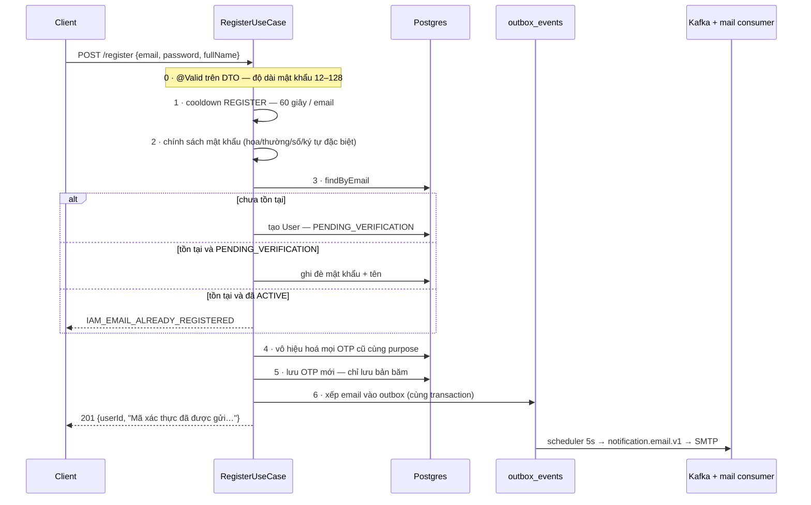

# IAM — Đăng ký & OTP

> `POST /auth/register` · `POST /auth/verify-otp` · `POST /auth/resend-otp`
> Bối cảnh: [IAM — Tour](iam-00-tour.md)

---

## 1. Bài toán

Cần chắc chắn người đăng ký thật sự sở hữu địa chỉ email họ khai. Cách rẻ nhất: gửi một mã, bắt nhập lại.

Bốn thứ phải xử lý cho đúng, và mỗi thứ đều có bẫy riêng:

1. **Đăng ký dở dang.** Người dùng đăng ký rồi không nhận được mail, hoặc đóng tab. Lần sau họ quay lại thì sao? Báo "email đã tồn tại" là khoá luôn địa chỉ đó vĩnh viễn.
2. **Mã bị dò.** Mã 6 số chỉ có một triệu khả năng.
3. **Endpoint gửi mail miễn phí cho kẻ xấu.** Không chặn thì ai cũng bắt hệ thống spam người khác được.
4. **Lần thử sai phải được ghi lại** — mà ghi thế nào khi việc ném lỗi làm rollback transaction?

---

## 2. Luồng



Xác thực là một luồng riêng, ngắn hơn:

```
POST /verify-otp {userId, code, purpose}
  1 · rate limit — 10/phút theo IP và theo userId
  2 · tìm OTP đang hoạt động của (user, purpose)
  3 · OtpCode.verify(code) — khoá / hết hạn / sai / đúng
  4 · user.verifyOtp() → ACTIVE
  5 · phát access token + refresh token
```

**Xác thực OTP thành công thì đăng nhập luôn.** Nó trả về cùng `LoginResult` như `login`, đi qua cùng `respondWithTokens`, đặt cùng cookie. Người dùng không phải đăng nhập lại sau khi xác thực — một quyết định trải nghiệm được cài đặt bằng cách tái dùng nguyên kiểu trả về.

---

## 3. Ghi đè bản đăng ký chưa xác thực

Đây là câu trả lời cho bẫy số 1:

```java
private User reRegisterUnverified(User existing, RegisterCommand command) {
    if (existing.getStatus() != UserStatus.PENDING_VERIFICATION) {
        throw new BusinessException(IamErrorCode.EMAIL_ALREADY_REGISTERED);
    }
    existing.changePassword(Password.fromHash(passwordHasher.hash(command.rawPassword())));
    existing.changeFullName(command.fullName());
    return userRepository.save(existing);
}
```

Một địa chỉ kẹt ở `PENDING_VERIFICATION` nghĩa là **chưa ai chứng minh mình sở hữu nó**. Nên bản ghi đó không đáng được bảo vệ như một tài khoản thật — ghi đè là đúng. Nếu từ chối, một người gõ nhầm email rồi đăng ký lại đúng sẽ bị chặn vĩnh viễn ở địa chỉ họ thực sự sở hữu.

Mặt trái cần biết: ai cũng ghi đè được `fullName` và mật khẩu của một bản ghi `PENDING_VERIFICATION` bất kỳ, chỉ cần biết email. Không nguy hiểm vì bản ghi đó chưa đăng nhập được, nhưng nó có nghĩa là **`PENDING_VERIFICATION` không phải một chỗ giữ chỗ**.

---

## 4. Mật khẩu bị kiểm hai lần, ở hai chỗ khác nhau

Chi tiết này chỉ lộ ra khi thử thật:

| Mật khẩu | Chặn bởi | Trả về |
|---|---|---|
| `abc` | **Bean Validation trên DTO** — `@Size(min=12,max=128)` | `VALIDATION_FAILED`, kèm `{"password":["size must be between 12 and 128"]}` |
| `abcdefghijklmnop` | `ValidatePasswordPolicyUseCase` | `IAM_002` "Mật khẩu quá yếu" |

Hai tầng, hai mã lỗi, hai hình dạng response khác nhau — cho cùng một khái niệm "mật khẩu không đạt".

**Vấn đề thật sự:** con số 12 và 128 nằm **cứng trong annotation** của `RegisterRequest`, đồng thời cũng nằm trong cấu hình:

```yaml
pwb.iam.password-policy:
  min-length: 12
  max-length: 128
```

Đổi cấu hình thành `min-length: 16` sẽ **không có tác dụng** — DTO vẫn nhận mật khẩu 12 ký tự, và nó tới được tầng policy thì mới bị chặn, với mã lỗi khác. Hai nguồn sự thật cho cùng một quy tắc.

Bộ quy tắc đầy đủ ở tầng policy (`PasswordPolicyAdapter`): quá ngắn · quá dài · thiếu chữ hoa · thiếu chữ thường · thiếu chữ số · thiếu ký tự đặc biệt · có khoảng trắng. Adapter duyệt **một vòng qua từng ký tự** thay vì dùng regex, kèm comment giải thích: `String.matches` biên dịch lại `Pattern` mỗi lần gọi, mà hàm này chạy ở mọi lần đăng ký.

> **Điểm chưa ổn:** adapter tính ra thông điệp cho **từng** vi phạm, nhưng response chỉ có đúng câu `"Mật khẩu quá yếu"` — người dùng không biết thiếu chữ hoa hay thiếu ký tự đặc biệt. Danh sách vi phạm không tới được client.

---

## 5. OTP được bảo vệ bằng bốn lớp

| Lớp | Cơ chế | Cấu hình |
|---|---|---|
| Mã lưu dạng băm | `code_hash`, không bao giờ lưu 6 số thô | — |
| Hết hạn | 10 phút | `otp.ttl-minutes: 10` |
| Số lần thử | 5 lần sai → `LOCKED` | `otp.max-attempts: 5` |
| Cooldown gửi lại | 60 giây mỗi email | `otp.resend-cooldown-seconds: 60` |
| Hạn mức ngày | 10 mã mỗi purpose mỗi ngày | `otp.daily-limit: 10` |

`OtpCode.verify` kiểm theo đúng thứ tự **khoá → hết hạn → so mã**, và mỗi lần sai thì tăng bộ đếm rồi kiểm lại ngưỡng ngay để trả về `maxAttemptsReached: true` đúng ở lần cuối cùng.

Phát hành mã mới **vô hiệu hoá mọi mã cũ cùng purpose** (`invalidateAllByUserAndPurpose`). Nếu không, một người bấm "gửi lại" ba lần sẽ có ba mã cùng hợp lệ, và ba lần bề mặt để dò.

> **Chụp thật sau một lần đăng ký:**
>
> ```
>  purpose  | status  | attempts |     hash      |    còn lại
> ----------+---------+----------+---------------+--------------
>  REGISTER | PENDING |        0 | 5906493acc69… | 00:09:25.73
> ```
>
> Đúng một dòng, mã ở dạng băm, TTL còn 9 phút 25 giây.

### 5.1. Một chỗ không đối xứng

`assertDailyQuotaAvailable` — hạn mức 10 mã/ngày — **chỉ được gọi trong `resend-otp`**, không gọi trong `register`.

Hệ quả: đăng ký lặp lại bị chặn bởi cooldown 60 giây, nhưng **không** bị chặn bởi hạn mức ngày. Kiên nhẫn mỗi phút một lần thì phát được 1440 mã/ngày cho cùng một địa chỉ. Cooldown 60 giây khiến việc này chậm tới mức vô nghĩa với người tấn công, nhưng sự bất đối xứng là có thật và trông giống một chỗ bị bỏ sót hơn là một quyết định.

---

## 6. Bẫy transaction: ghi nhận lần thử sai

Đây là chi tiết kỹ thuật hay nhất của luồng này.

Nhập sai mã thì use case ném exception → **transaction rollback** → bộ đếm `attempts` vừa tăng cũng bị cuốn theo. Kết quả: mã có thể dò vô hạn, vì không lần sai nào được ghi lại.

Cách chữa — ghi bằng một transaction **riêng**, cam kết trước khi exception lan ra:

```java
@Transactional(propagation = Propagation.REQUIRES_NEW)
public void recordFailure(UUID otpId) {
    otpCodeRepository.incrementAttempts(otpId);
    boolean locked = otpCodeRepository.markLockedIfNotAlready(otpId, otpPolicy.maxAttempts());
    ...
}
```

`REQUIRES_NEW` tạm treo transaction đang chạy, mở một transaction mới, commit nó, rồi trả quyền lại. Việc rollback sau đó không đụng tới cái đã commit.

Cùng khuôn mẫu ấy xuất hiện ở chỗ khác trong hệ thống với **giải pháp khác**: bộ đếm đăng nhập sai để trong Redis, mà Redis thì không tham gia transaction của Postgres nên vấn đề không phát sinh. Hai bài toán giống nhau, hai lời giải khác nhau tuỳ nơi lưu.

---

## 7. Email đi đường nào

`OtpIssuer` không gửi mail. Nó gọi `emailDeliveryPort.enqueue(...)`, và adapter làm ba việc **ngay tại chỗ**, trong transaction:

1. Dịch tiêu đề theo locale
2. Kết xuất Thymeleaf ra bản HTML và bản text
3. Phát một `EmailEventRequested` → ghi vào `outbox_events`

Nội dung email được **kết xuất sẵn** rồi mới xếp hàng, không phải kết xuất lúc gửi. Nghĩa là consumer không cần biết gì về template hay ngôn ngữ — nó chỉ việc gửi cái đã có. Đổi lại, payload trong outbox to hơn, và sửa template không ảnh hưởng tới mail đang xếp hàng.

> **Chụp thật:** hai dòng `EmailPersisted` → `notification.email.v1`, `status = SENT`, `retry_count = 0`.

---

## 8. Quyết định & đánh đổi

| Quyết định | Thay vì | Vì sao | Cái giá |
|---|---|---|---|
| Ghi đè bản `PENDING_VERIFICATION` | Báo trùng email | Gõ nhầm email không khoá vĩnh viễn địa chỉ thật | Bản ghi chưa xác thực bị người khác ghi đè được |
| Xác thực OTP xong cấp token luôn | Bắt đăng nhập lại | Bớt một bước ngay lúc người dùng dễ bỏ cuộc nhất | Đường cấp token có hai lối vào, phải giữ đồng bộ |
| Lưu băm của mã OTP | Lưu 6 số thô | Rò rỉ DB không thành chiếm tài khoản | Debug không đọc lại được mã |
| Vô hiệu hoá mã cũ khi phát mã mới | Cho nhiều mã cùng sống | Chỉ một bề mặt để dò | Bấm "gửi lại" làm mã trong mail cũ chết ngay |
| `REQUIRES_NEW` cho lần thử sai | Ghi trong transaction chính | Rollback không xoá mất bộ đếm | Một transaction lồng, khó thấy khi đọc lướt |
| Kết xuất email trước khi xếp hàng | Kết xuất lúc gửi | Consumer không cần biết template/locale | Payload outbox lớn |
| Cooldown 60s cho `register` | Rate limit theo phút | Chặn đúng hành vi bấm liên tục | Người dùng thật cũng phải chờ đủ 60 giây |

---

## 9. Tự kiểm chứng

**Đăng ký và xem cooldown chặn ngay lần thứ hai:**

```bash
E="test-$(date +%s)@example.com"; curl -s -X POST http://localhost:8080/api/v1/auth/register -H "Content-Type: application/json" -H "Accept-Language: vi" -d "{\"email\":\"$E\",\"password\":\"@NamHoang511\",\"fullName\":\"Test\"}"; echo; curl -s -X POST http://localhost:8080/api/v1/auth/register -H "Content-Type: application/json" -H "Accept-Language: vi" -d "{\"email\":\"$E\",\"password\":\"@NamHoang511\",\"fullName\":\"Test\"}"
```

Lần hai: `IAM_026` kèm `"error":{"retryAfterSeconds":59}`.

**Thấy hai tầng kiểm mật khẩu** — đổi `password` thành `abc` (ra `VALIDATION_FAILED`) rồi thành `abcdefghijklmnop` (ra `IAM_002`).

**Xem hàng OTP:**

```bash
docker exec -e PGPASSWORD="$(grep -E '^POSTGRES_PASSWORD=' .env | cut -d= -f2-)" pwb-postgres psql -U pwb_user -d pwb_db -c "SELECT purpose, status, attempts, expires_at - now() AS con_lai FROM iam_otp_codes ORDER BY created_at DESC LIMIT 5;"
```

**Xem email đã ra tới outbox:**

```bash
docker exec -e PGPASSWORD="$(grep -E '^POSTGRES_PASSWORD=' .env | cut -d= -f2-)" pwb-postgres psql -U pwb_user -d pwb_db -c "SELECT event_type, topic, status, retry_count FROM outbox_events WHERE event_type='EmailPersisted' ORDER BY created_at DESC LIMIT 5;"
```

**Xem bộ đếm sai bị khoá** — gọi `verify-otp` 5 lần với mã sai cho cùng `userId`, xem cột `attempts` tăng và `status` chuyển `LOCKED`. Vì mã lưu dạng băm, đây là cách duy nhất thử mà không cần đọc email.

---

## 10. Giới hạn hiện tại

| Giới hạn | Chi tiết |
|---|---|
| Hai nguồn sự thật cho độ dài mật khẩu | `@Size(12,128)` cứng trong DTO và `password-policy.*` trong cấu hình — mục 4 |
| Không nói được mật khẩu yếu ở chỗ nào | Danh sách vi phạm được tính rồi bỏ đi — mục 4 |
| `register` không kiểm hạn mức ngày | Chỉ `resend-otp` kiểm — mục 5.1 |
| Bản `PENDING_VERIFICATION` ai cũng ghi đè được | Biết email là ghi đè được tên và mật khẩu — mục 3 |
| Không có đường lấy lại mã khi debug | Hệ quả cố ý của việc lưu băm; phải đọc email hoặc log consumer |
| Email hỏng thì người dùng không biết | `register` trả 201 ngay khi xếp hàng; mail thất bại rơi vào `notification.email.v1.DLT` mà không có gì báo ngược lại |
