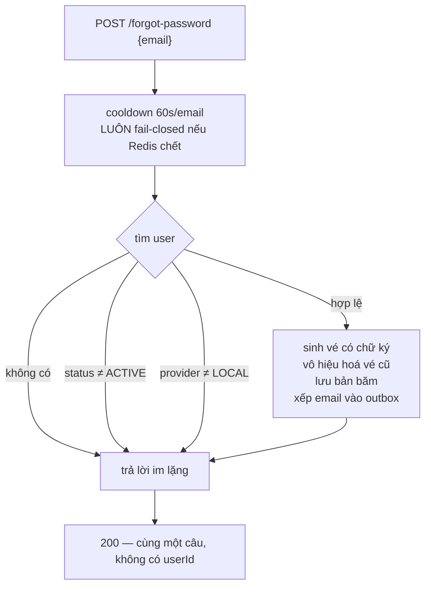
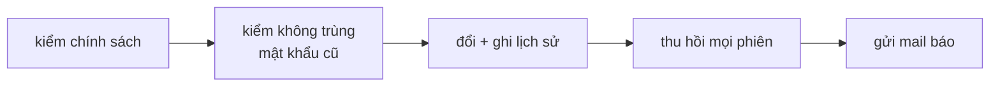

# IAM — Mật khẩu: quên, đặt lại, đổi

> `POST /auth/forgot-password` · `POST /auth/reset-password` · `POST /auth/change-password`
> Bối cảnh: [IAM — Tour](iam-00-tour.md)

---

## 1. Bài toán

Hai tình huống khác hẳn nhau nhưng cùng kết thúc ở một chỗ:

- **Quên mật khẩu** — người dùng *không* chứng minh được danh tính. Phải xác minh qua email, và endpoint thì công khai với cả internet.
- **Đổi mật khẩu** — người dùng *đã* đăng nhập. Chỉ cần hỏi lại mật khẩu hiện tại.

Đường thứ nhất khó hơn nhiều, vì nó phải trả lời được: làm sao gửi vé đặt lại mà không biến endpoint thành máy dò xem email nào đã đăng ký, và không thành máy phát tán thư miễn phí.

---

## 2. Quên mật khẩu — nguyên tắc "luôn trả lời giống nhau"

Comment trong code nói thẳng ý đồ: *bất kỳ nhánh nào trả lời khác đi cũng biến endpoint công khai này thành máy tra cứu sự tồn tại của tài khoản.*



**Bốn nhánh, một câu trả lời.** Email không tồn tại, tài khoản chưa xác thực, tài khoản bị cấm, tài khoản Google — tất cả nhận cùng response như trường hợp gửi thành công. Response cũng **không echo `userId`**, khác với `register`.

### 2.1. Chỗ duy nhất luôn fail-closed

Cooldown của luồng này bỏ qua cấu hình chung:

```java
purpose == CooldownPurpose.PASSWORD_RESET || rateLimitProperties.isFailClosedForCriticalOps()
```

Nghĩa là kể cả khi hệ thống được cấu hình fail-open, cooldown đặt lại mật khẩu **vẫn** từ chối khi Redis chết. Comment giải thích: endpoint này gửi mail tới một địa chỉ tuỳ ý, để hở cooldown trong lúc Redis sập là biến nó thành trạm phát tán thư không có bộ đếm.

Đây là chỗ duy nhất trong cả hệ thống ghi đè cấu hình fail-open như vậy.

### 2.2. Vé đặt lại mật khẩu có hai lớp

Không phải một chuỗi ngẫu nhiên đơn thuần:

```
signedToken  =  rawToken  +  chữ ký HMAC          ← thứ đi trong link email
tokenHash    =  băm(rawToken)                     ← thứ lưu trong database
```

Khi đổi mật khẩu, `reset-password` kiểm **chữ ký trước**, rồi mới tra database:

```java
if (!passwordResetTokenService.verifySignature(command.token())) {
    throw new BusinessException(IamErrorCode.AUTH_RESET_TOKEN_INVALID);
}
```

Vì sao đáng làm vậy: một vé bịa ra sẽ trượt ở bước kiểm chữ ký — **không tốn một truy vấn database nào**. Chỉ vé mang chữ ký đúng mới được phép chạm tới bảng. Nó biến endpoint từ "ai cũng bắt tôi query được" thành "phải có khoá bí mật mới bắt tôi query được".

Khoá ký lấy từ `APP_PASSWORD_RESET_TOKEN_SECRET`, **không có giá trị mặc định** — thiếu là ứng dụng không khởi động, cùng nguyên tắc với khoá ký JWT.

Vé sống **30 phút**, và phát vé mới thì `invalidateAllForUser` giết mọi vé cũ — cùng khuôn với OTP.

---

## 3. Đổi mật khẩu — đường ngắn hơn

Đã đăng nhập nên không cần giấu gì:

```
1 · rate limit — 5/phút theo IP và theo userId
2 · từ chối nếu là tài khoản Google        → AUTH_OAUTH_USER_NO_PASSWORD
3 · từ chối nếu không có mật khẩu           → AUTH_INVALID_CURRENT_PASSWORD
4 · so mật khẩu hiện tại (BCrypt)           → AUTH_INVALID_CURRENT_PASSWORD
5 · kiểm chính sách mật khẩu mới
6 · kiểm không trùng mật khẩu cũ
7 · đổi, lưu, ghi vào lịch sử
8 · thu hồi mọi refresh token
9 · gửi email báo đã đổi mật khẩu
```

Thứ tự bước 5 trước bước 6 là cố ý, và code có comment: bước 5 chỉ là kiểm chuỗi, còn bước 6 chạy **một phép BCrypt cho mỗi mật khẩu trong lịch sử**. Từ chối một mật khẩu yếu ở bước 5 tránh được tối đa 6 phép BCrypt mà kết quả sẽ bị vứt đi.

---

## 4. Bốn bước chung của cả hai đường

Từ chỗ này trở đi, `reset-password` và `change-password` làm y hệt nhau:



### 4.1. Kiểm trùng: mật khẩu hiện tại + 5 bản cũ

```java
public void assertNotReused(UUID userId, String newRawPassword, String currentHash) {
    if (currentHash != null && passwordHasher.matches(newRawPassword, currentHash)) {
        throw new BusinessException(IamErrorCode.AUTH_PASSWORD_REUSED);
    }
    List<PasswordHistory> history = passwordHistoryRepository
            .findByUserIdOrderByCreatedAtDesc(userId, PasswordHistory.MAX_HISTORY_SIZE);
    for (PasswordHistory entry : history) {
        if (passwordHasher.matches(newRawPassword, entry.getPasswordHash())) {
            throw new BusinessException(IamErrorCode.AUTH_PASSWORD_RECENTLY_USED);
        }
    }
}
```

`MAX_HISTORY_SIZE = 5`, hằng số trong domain model chứ không phải cấu hình.

**Hai mã lỗi khác nhau** cho hai tình huống: dùng lại đúng mật khẩu đang có (`AUTH_PASSWORD_REUSED`) khác với dùng lại một mật khẩu cũ (`AUTH_PASSWORD_RECENTLY_USED`). Người dùng cần biết mình đang gõ nhầm cái nào.

Chi phí: **tối đa 6 phép BCrypt** mỗi lần đổi mật khẩu, chạy tuần tự. BCrypt cố tình chậm, nên đây là endpoint tốn CPU nhất của IAM — và cũng là lý do rate limit của nó thấp nhất (5/phút).

`record` chỉ ghi khi có hash cũ để ghi, rồi tự cắt bớt phần thừa quá 5 bản. Lịch sử không phình vô hạn.

### 4.2. Thu hồi phiên — và chỗ nó không với tới

Cả hai đường đều gọi `revokeAllRefreshTokensForUser`. Đúng: đổi mật khẩu xong thì mọi thiết bị khác phải đăng nhập lại.

**Nhưng access token đã phát vẫn sống nốt tối đa 15 phút.** Muốn giết chúng phải đưa `jti` vào danh sách đen, mà cả hai use case đều không biết `jti` nào đang lưu hành — thông tin đó không được lưu ở đâu cả.

Tình huống thật: ai đó chiếm được tài khoản, bạn đổi mật khẩu để đuổi họ ra. Refresh token của họ chết ngay, nhưng access token họ đang cầm còn dùng được tới 15 phút nữa.

Cách chữa cần một tập `userId → các jti đang sống` trong Redis, TTL 15 phút. Chưa có.

### 4.3. Email báo đã đổi mật khẩu

`accountNotifier.passwordChanged(...)` — thông báo sau khi việc đã xong. Đây là cách người dùng biết tài khoản mình bị chiếm: họ nhận mail báo đổi mật khẩu mà không phải họ làm.

---

## 5. Tài khoản Google: cùng điều kiện, ba cách phản ứng

| Endpoint | Gặp `oauthProvider != LOCAL` | Vì sao |
|---|---|---|
| `change-password` | Ném `AUTH_OAUTH_USER_NO_PASSWORD` | Đã đăng nhập rồi, nói thật được |
| `reset-password` | Ném `AUTH_OAUTH_USER_NO_PASSWORD` | Đã cầm vé hợp lệ, tức là đã sở hữu email |
| `forgot-password` | **Im lặng**, giả vờ đã gửi | Public — nói thật là rò rỉ "địa chỉ này dùng Google" |

Ba cách xử lý cho cùng một điều kiện, và cả ba đều đúng trong ngữ cảnh của nó. Đây là ví dụ rõ nhất trong hệ thống về việc **endpoint công khai hay không quyết định được phép nói gì**.

---

## 6. Quyết định & đánh đổi

| Quyết định | Thay vì | Vì sao | Cái giá |
|---|---|---|---|
| Bốn nhánh, một câu trả lời | Báo lỗi cụ thể | Không rò rỉ tài khoản nào tồn tại | Người dùng gõ nhầm email không biết mình gõ nhầm |
| Vé có chữ ký HMAC | Chuỗi ngẫu nhiên thuần | Vé bịa bị chặn trước khi chạm database | Thêm một khoá bí mật phải quản lý |
| Cooldown reset **luôn** fail-closed | Theo cấu hình chung | Redis chết không biến endpoint thành trạm phát thư | Redis chết là không ai đặt lại được mật khẩu |
| Lịch sử 5 mật khẩu | Không giữ lịch sử | Chặn xoay vòng vài mật khẩu quen | Tối đa 6 BCrypt mỗi lần đổi |
| Kiểm chính sách trước kiểm trùng | Ngược lại | Mật khẩu yếu bị loại trước khi tốn BCrypt | Không |
| Thu hồi refresh token khi đổi mật khẩu | Giữ nguyên phiên | Đuổi được kẻ chiếm tài khoản | Người dùng bị đăng xuất trên mọi thiết bị |
| `MAX_HISTORY_SIZE` là hằng số | Đưa vào cấu hình | Một chỗ, khỏi lệch | Muốn đổi phải sửa code |
| Vé sống 30 phút | Dài hơn | Vé lọt ra ngoài chỉ dùng được trong 30 phút | Người dùng chậm phải xin vé mới |

---

## 7. Tự kiểm chứng

**Xem `forgot-password` trả lời y hệt nhau cho email có thật và email bịa:**

```bash
curl -s -X POST http://localhost:8080/api/v1/auth/forgot-password -H "Content-Type: application/json" -H "Accept-Language: vi" -d '{"email":"user1@gmail.com"}'; echo; curl -s -X POST http://localhost:8080/api/v1/auth/forgot-password -H "Content-Type: application/json" -H "Accept-Language: vi" -d '{"email":"khong-he-ton-tai@example.com"}'
```

Hai response phải giống nhau từng chữ, trừ `traceId` và `timestamp`.

**Xem cooldown 60 giây** — gọi lại ngay cho cùng email, nhận `IAM_014` kèm `retryAfterSeconds`.

**Xem vé bịa bị chặn ở bước chữ ký:**

```bash
curl -s -X POST http://localhost:8080/api/v1/auth/reset-password -H "Content-Type: application/json" -d '{"token":"toi-tu-bia-ra-cai-nay","newPassword":"@NamHoang511"}'
```

`IAM_031`, và **không có truy vấn nào** chạm bảng `iam_password_reset_tokens`.

**Xem vé trong database:**

```bash
docker exec -e PGPASSWORD="$(grep -E '^POSTGRES_PASSWORD=' .env | cut -d= -f2-)" pwb-postgres psql -U pwb_user -d pwb_db -c "SELECT used_at, expires_at - now() AS con_lai FROM iam_password_reset_tokens ORDER BY created_at DESC LIMIT 5;"
```

**Xem lịch sử mật khẩu lớn dần rồi dừng ở 5:**

```bash
docker exec -e PGPASSWORD="$(grep -E '^POSTGRES_PASSWORD=' .env | cut -d= -f2-)" pwb-postgres psql -U pwb_user -d pwb_db -c "SELECT user_id, count(*) FROM iam_password_history GROUP BY 1;"
```

**Xem việc thu hồi phiên có thật** — đăng nhập, đổi mật khẩu, rồi thử `refresh` bằng cookie cũ. Nhận `IAM_012`.

---

## 8. Giới hạn hiện tại

| Giới hạn | Chi tiết |
|---|---|
| Access token sống sót qua lần đổi mật khẩu | Tối đa 15 phút — mục 4.2, cần tập `userId → jti` trong Redis |
| Redis chết là không đặt lại được mật khẩu | Hệ quả cố ý của fail-closed — mục 2.1 |
| Đổi mật khẩu là endpoint tốn CPU nhất | Tối đa 6 BCrypt tuần tự — mục 4.1 |
| Không nói được mật khẩu yếu ở chỗ nào | Chung với [iam-01 §4](iam-01-dang-ky-va-otp.md) |
| `MAX_HISTORY_SIZE` không cấu hình được | Hằng số trong domain model |
| Mail báo đổi mật khẩu không đảm bảo tới | Đi qua outbox → Kafka; thất bại rơi vào DLT, không có gì báo ngược |
| Không có "đăng xuất thiết bị khác" cho người dùng | Chỉ có thu hồi toàn bộ, và chỉ như tác dụng phụ của việc đổi mật khẩu |
