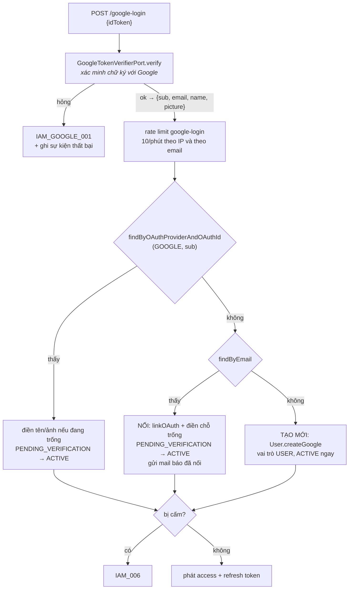

# IAM — Đăng nhập Google

> `POST /auth/google-login`
> Bối cảnh: [IAM — Tour](iam-00-tour.md)

---

## 1. Bài toán

Người dùng bấm "Đăng nhập với Google", trình duyệt lấy được một **ID token** từ Google và gửi lên. Backend phải trả lời: token này thật không, và người này là ai trong hệ thống của mình?

Câu thứ hai khó hơn câu thứ nhất, vì có **ba** khả năng và chúng không hiển nhiên:

1. Đã từng đăng nhập Google → tìm thấy theo `(GOOGLE, sub)`
2. Chưa từng, nhưng **email đã có tài khoản local** → phải nối hai thứ lại
3. Hoàn toàn mới → tạo tài khoản

Trường hợp 2 là chỗ dễ sai nhất, và cũng là chỗ có rủi ro bảo mật thật.

---

## 2. Luồng



Khoá tra cứu chính là **`sub` của Google, không phải email**. `sub` là định danh không đổi của một tài khoản Google; email thì đổi được. Tra theo email trước sẽ vỡ ngay khi ai đó đổi địa chỉ Gmail.

---

## 3. Thứ tự kiểm: xác minh token trước, rate limit sau

Ngược với `login`, ở đó rate limit là bước đầu tiên. Ở đây:

```java
try {
    payload = googleTokenVerifier.verify(command.idToken());
} catch (BusinessException ex) {
    authEventPublisher.publishGoogleLoginFailed("unknown", clientIp, userAgent, ex.getMessage());
    throw ex;
}
rateLimitGuard.checkIpAndSubject("google-login", clientIp, payload.email(), ...);
```

Lý do bắt buộc: bucket rate limit khoá theo **email**, mà email chỉ biết được **sau khi** giải mã token. Không có cách nào đảo ngược thứ tự này mà vẫn giữ được bucket theo email.

Cái giá: một kẻ bắn token rác liên tục sẽ buộc hệ thống xác minh từng cái trước khi bị chặn. Đỡ được phần nào nhờ hai điều — bucket theo IP vẫn hoạt động sau đó, và tầng `HttpRateLimitFilter` 500 request/phút nằm phía trước ([01 §5.1](01-architecture-overview.md)).

Chú ý sự kiện thất bại ghi email là `"unknown"` — đúng, vì lúc đó chưa giải mã được token thì chưa biết email nào.

---

## 4. Nối tài khoản — chỗ đáng cân nhắc nhất

```java
User byEmail = userRepository.findByEmail(payload.email()).orElse(null);
if (byEmail == null) return createFromGoogle(payload, locale);

if (byEmail.isBlocked()) throw new BusinessException(IamErrorCode.ACCOUNT_INACTIVE);
byEmail.linkOAuth(OAuthProvider.GOOGLE, payload.sub());
applyGoogleDefaults(byEmail, payload);
if (byEmail.getStatus() == UserStatus.PENDING_VERIFICATION) {
    byEmail.markActive();     // Google đã bảo lãnh cho địa chỉ này rồi
}
```

Ba việc xảy ra ở đây, và mỗi việc là một quyết định:

**Nối, không tạo trùng.** Một người đăng ký bằng email rồi sau đó bấm "Đăng nhập với Google" cùng địa chỉ sẽ vào **đúng tài khoản cũ**, không phải một tài khoản thứ hai. Không nối thì họ mất hết bài hát và phòng của mình mà không hiểu vì sao.

**`PENDING_VERIFICATION` được nâng thẳng lên `ACTIVE`.** Mã OTP đang chờ trở nên vô nghĩa: Google vừa chứng minh người này đọc được hòm thư đó, mạnh hơn hẳn việc nhập một mã 6 số gửi tới chính hòm thư ấy. Đây là **đường thứ hai vào `ACTIVE`** trong sơ đồ trạng thái ở [tour §2](iam-00-tour.md).

**Người dùng được báo bằng email**, với comment giải thích: *nối tài khoản tạo ra một lối vào thứ hai, nên chủ tài khoản phải được biết.* Nếu không, việc nối là một thay đổi bảo mật quan trọng xảy ra hoàn toàn im lặng.

### 4.1. Việc nối an toàn tới đâu

Nối dựa trên **email do Google khẳng định**. Điều đó có nghĩa: ai kiểm soát tài khoản Google `nam@gmail.com` thì vào được tài khoản local đăng ký bằng `nam@gmail.com`, **không cần biết mật khẩu**.

Đúng trong hầu hết trường hợp — cùng một hòm thư thì thường là cùng một người. Nhưng nó chuyển toàn bộ niềm tin sang hai giả định:

1. Google chỉ cấp token cho người thật sự sở hữu địa chỉ đó
2. Địa chỉ trong token luôn đã được xác minh

Giả định 2 đáng chú ý: Google có trường `email_verified` trong ID token. **Code hiện không kiểm trường này** — nó dùng `payload.email()` trực tiếp. Với Google Workspace và Gmail thì email luôn đã xác minh, nên trong thực tế chưa thành vấn đề, nhưng đó là một lớp phòng vệ đang bỏ trống.

---

## 5. Điều gì xảy ra với mật khẩu

Tài khoản Google **không có mật khẩu**, và ba endpoint từ chối nó theo ba kiểu khác nhau — bảng đầy đủ ở [iam-02 §5](iam-02-mat-khau.md).

Trường hợp tài khoản **được nối** thì thú vị hơn: nó *có* mật khẩu cũ từ hồi đăng ký local, nhưng `oauthProvider` giờ là `GOOGLE`. Kiểm tra trong code là `oauthProvider != LOCAL`, nên tài khoản nối **mất quyền đổi mật khẩu** dù mật khẩu cũ vẫn còn trong database.

Và ở luồng đăng nhập thường, `LoginUseCaseImpl` gộp `user.getPassword() == null` vào nhánh sai thông tin — nhưng tài khoản nối thì `getPassword()` **không null**, nên họ vẫn đăng nhập bằng mật khẩu cũ được. Hai đường vào cùng tồn tại, chỉ đường đổi mật khẩu bị chặn.

Sự bất đối xứng này không có chỗ nào ghi lại là cố ý.

---

## 6. Cấu hình

```yaml
pwb.iam.google:
  client-id: ${GOOGLE_CLIENT_ID:}
  clock-skew-seconds: 30
```

`client-id` **có mặc định rỗng**, khác với khoá ký JWT và khoá ký vé đặt lại mật khẩu — hai cái đó thiếu là ứng dụng không khởi động. Ở đây rỗng vẫn chạy được, chỉ là mọi lần đăng nhập Google đều hỏng. Hợp lý cho môi trường dev không cần Google, nhưng nghĩa là **cấu hình sai chỉ lộ ra khi có người dùng thử tính năng**, không lộ lúc khởi động.

`clock-skew-seconds: 30` cho phép đồng hồ server lệch Google 30 giây — cùng con số với JWT nội bộ.

---

## 7. Quyết định & đánh đổi

| Quyết định | Thay vì | Vì sao | Cái giá |
|---|---|---|---|
| Tra theo `sub`, không theo email | Tra theo email | `sub` không đổi, email thì đổi được | Cần thêm cột và một index nữa |
| Nối vào tài khoản local cùng email | Tạo tài khoản thứ hai | Người dùng không mất dữ liệu cũ | Ai kiểm soát Gmail thì vào được tài khoản local |
| `PENDING_VERIFICATION` → `ACTIVE` khi nối | Vẫn bắt nhập OTP | Google đã chứng minh mạnh hơn OTP | Đường thứ hai vào `ACTIVE`, phải nhớ khi đọc sơ đồ trạng thái |
| Gửi mail khi nối | Nối im lặng | Thêm lối vào tài khoản thì chủ phải biết | Thêm một mail |
| Xác minh token trước rate limit | Rate limit trước | Bucket cần email, mà email nằm trong token | Token rác vẫn tốn một lần xác minh |
| `client-id` mặc định rỗng | Bắt buộc như khoá JWT | Dev không cần Google vẫn chạy được | Cấu hình sai chỉ lộ khi có người dùng thử |
| Giá trị từ Google chỉ **điền chỗ trống** | Đồng bộ đè mỗi lần đăng nhập | Tên/ảnh người dùng tự đặt không bị Google ghi đè | Đổi tên bên Google không phản ánh sang đây |

Dòng cuối là chi tiết dễ làm sai nhất và code làm đúng, có comment ghi rõ *"Google values only fill gaps"*:

```java
if (isPresent(payload.picture()) && !isPresent(user.getAvatarUrl())) { … }
if (isPresent(payload.name())    && !isPresent(user.getFullName()))  { … }
```

`refreshFromGoogle` chạy ở **mọi** lần đăng nhập, nhưng nó chỉ ghi khi trường đích đang rỗng, và chỉ gọi `save` khi thật sự có thay đổi (`changed`). Người dùng đổi tên hiển thị trong hồ sơ ([iam-04](iam-04-profile-va-avatar.md)) giữ được tên đó mãi mãi.

---

## 8. Tự kiểm chứng

Không tạo được ID token hợp lệ nếu không đi qua Google thật, nên phần kiểm chứng ở đây hạn chế hơn các file khác.

**Xem token không hợp lệ bị từ chối:**

```bash
curl -s -X POST http://localhost:8080/api/v1/auth/google-login -H "Content-Type: application/json" -H "Accept-Language: vi" -d '{"idToken":"khong-phai-token-that"}'
```

`IAM_GOOGLE_001`.

**Xem có tài khoản Google nào trong hệ thống chưa:**

```bash
docker exec -e PGPASSWORD="$(grep -E '^POSTGRES_PASSWORD=' .env | cut -d= -f2-)" pwb-postgres psql -U pwb_user -d pwb_db -c "SELECT oauth_provider, count(*), count(password) AS co_mat_khau FROM iam_users GROUP BY 1;"
```

Cột `co_mat_khau` cho thấy ngay có tài khoản **nối** nào không: `oauth_provider = GOOGLE` mà vẫn có mật khẩu chính là trường hợp ở mục 5.

**Thử luồng nối đầy đủ** cần `GOOGLE_CLIENT_ID` thật và đăng nhập qua giao diện: đăng ký local bằng chính địa chỉ Gmail của bạn, đừng xác thực OTP, rồi bấm đăng nhập Google. Xem `oauth_id` được điền và `status` nhảy sang `ACTIVE`.

---

## 9. Giới hạn hiện tại

| Giới hạn | Chi tiết |
|---|---|
| Không kiểm `email_verified` của Google | Mục 4.1 — một lớp phòng vệ đang bỏ trống |
| Tài khoản nối mất quyền đổi mật khẩu | Nhưng vẫn đăng nhập bằng mật khẩu cũ được — mục 5, không rõ có cố ý |
| Tên hiển thị bị Google ghi đè mỗi lần đăng nhập | Mục 7 |
| Chỉ hỗ trợ Google | `OAuthProvider` là enum, thêm nhà cung cấp khác cần một verifier port mới |
| Không có đường gỡ liên kết | Đã nối là nối vĩnh viễn |
| `client-id` sai chỉ lộ lúc chạy | Mục 6 |
