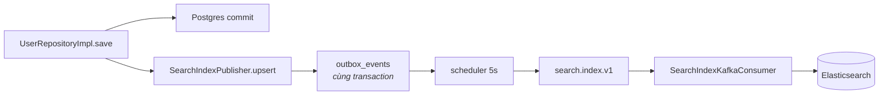

# IAM — Tìm kiếm người dùng

> `GET /admin/users/search` · `GET /admin/users/suggest` · `GET|POST /admin/search/indices|reindex`
> Bối cảnh: [IAM — Tour](iam-00-tour.md)
> Cơ chế đồng bộ mô tả ở đây **dùng chung** cho cả `pwb_songs`, `pwb_voice_tags`, `pwb_rooms`.

---

## 1. Bài toán

Tìm người dùng theo từ khoá gõ dở, gõ sai chính tả, khớp một phần email. Postgres `LIKE '%…%'` làm được nhưng không xếp hạng được, không gợi ý được, và không dùng được index.

Nhưng đưa tìm kiếm sang Elasticsearch tạo ra ba vấn đề mới:

1. **Hai bản sao dữ liệu** → chúng lệch nhau lúc nào?
2. **Thêm một thứ có thể chết** → cluster sập thì trang quản trị có sập theo không?
3. **Ghi vào ES lúc nào** → trong transaction nghiệp vụ, hay sau?

Ba câu trả lời của hệ thống này đều là cùng một triết lý: **tìm kiếm là tiện ích, không phải sự thật.**

---

## 2. Đồng bộ: ES không bao giờ được ghi trực tiếp



Đây là **đường B** trong [bản đồ hệ thống](00-ban-do-he-thong.md), và nó là nguồn phát sự kiện lớn nhất — 75 trong 83 dòng outbox.

Điểm mấu chốt nằm ở `SearchIndexPublisher.enqueue`:

```java
/**
 * A search index that falls behind is a degraded search, not a failed write. Serialisation problems
 * are therefore logged rather than thrown — letting one bubble up would abort the transaction of the
 * business operation that triggered it.
 */
private void enqueue(SearchIndexEvent event) {
    if (!config.isEnabled()) return;
    try {
        outboxEnqueueHelper.enqueue(topicProperties.getSearchIndex(), AGGREGATE_TYPE, event.docId(), ...);
    } catch (Exception ex) {
        log.warn("SEARCH.enqueue failed: index={} id={} action={} reason={}", ...);
    }
}
```

**Nuốt lỗi là cố ý.** Nếu ném, một sự cố tuần tự hoá JSON sẽ làm hỏng cả việc lưu người dùng — tìm kiếm lỗi kéo theo nghiệp vụ lỗi. Ưu tiên ngược lại: cứ lưu người dùng, index lệch thì sửa sau bằng `reindex`.

`config.isEnabled()` cho phép tắt hẳn tìm kiếm bằng `pwb.search.enabled: false`. Khi tắt, không dòng outbox nào được ghi và consumer cũng không khởi động (`@ConditionalOnProperty`) — hệ thống vẫn chạy đủ, chỉ mất phần xếp hạng.

---

## 3. Ngã về Postgres — cơ chế `Optional`

Port tìm kiếm không trả về danh sách, nó trả về `Optional`:

```java
Optional<UserSearchHits> search(UserSearchCriteria criteria, int from, int size);
Optional<List<UserSuggestion>> suggest(UserSearchCriteria criteria, int limit);
```

`Optional.empty()` nghĩa là *"engine không trả lời được"* — chứ không phải *"không có kết quả nào"*. Không tìm thấy gì là một `UserSearchHits` rỗng. Hai tình huống khác hẳn nhau và kiểu dữ liệu phân biệt được chúng.

Use case chỉ việc xử lý hai nhánh:

```java
Optional<UserSearchHits> hits = userSearchPort.search(criteria, offset, pageSize);
if (hits.isEmpty()) {
    log.debug("SEARCH.users fallback to database");
    return userJpaRepository
            .findAll(UserSpecifications.fromCriteria(criteria), pageable)
            .map(this::toView);
}
return toPage(hits.get(), pageable);
```

Kết hợp với timeout ngắn của Elasticsearch — kết nối 1s, đọc 2s, có comment trong `application.yml` giải thích: *một request tìm kiếm giữ một Tomcat worker suốt thời gian nó chờ, nên một cluster chậm sẽ xếp hàng cả việc vào phòng lẫn điều khiển nhạc phía sau. Bỏ cuộc nhanh và trả lời từ Postgres là lựa chọn tốt hơn hẳn.*

Và ở tầng healthcheck: `management.health.elasticsearch.enabled: false` — ES chết **không** làm container bị đánh dấu unhealthy và bị thay thế.

Ba tầng bảo vệ nhất quán với nhau: timeout ngắn → ngã về Postgres → không tính vào sức khoẻ.

---

## 4. Elasticsearch xếp hạng, Postgres cung cấp dữ liệu

Chi tiết quan trọng nhất của luồng đọc, và code có comment giải thích:

```java
/**
 * The engine ranked the ids; the rows come from Postgres so nothing renders from a stale copy.
 */
private Page<AdminUserView> toPage(UserSearchHits hits, Pageable pageable) {
    Map<UUID, UserJpaEntity> byId = userJpaRepository.findByIdInAndDeletedFalse(hits.ids()).stream()
            .collect(Collectors.toMap(UserJpaEntity::getId, Function.identity()));

    List<AdminUserView> ordered = hits.ids().stream()
            .map(byId::get)
            .filter(Objects::nonNull)
            .map(this::toView)
            .toList();

    return new PageImpl<>(ordered, pageable, hits.total());
}
```

**Elasticsearch chỉ trả về danh sách id theo thứ tự xếp hạng.** Nội dung hiển thị lấy từ Postgres. Nghĩa là index lệch không bao giờ khiến người dùng thấy dữ liệu cũ — nó chỉ khiến thứ tự hoặc thành phần kết quả hơi lệch.

`.filter(Objects::nonNull)` xử lý trường hợp id có trong index nhưng không còn trong database (đã xoá, index chưa kịp cập nhật): bản ghi đó **âm thầm rơi khỏi trang**.

Cái giá là một chỗ không nhất quán nhỏ: `hits.total()` là con số của Elasticsearch, nhưng danh sách trả về đã bị lọc bớt. Một trang có thể hiện "tìm thấy 20 kết quả" mà chỉ liệt kê 19 dòng.

Bộ lọc `deleted = false` được áp **cả hai phía** — index không nhận bản ghi đã xoá, và `findByIdInAndDeletedFalse` lọc thêm lần nữa. Thừa có chủ ý, vì hai bên có thể lệch nhau.

---

## 5. Gợi ý gõ dở

`suggest` cũng có đường ngã về, nhưng khác một điểm:

```java
if (criteria.keyword() == null || criteria.keyword().isBlank()) {
    return List.of();
}
int capped = Math.clamp(limit, 1, MAX_SUGGESTIONS);   // MAX_SUGGESTIONS = 20
```

Từ khoá rỗng thì **trả về rỗng ngay**, không chạm cả ES lẫn Postgres. Nếu không, ô gợi ý sẽ nã một truy vấn "lấy tất cả" mỗi lần người dùng xoá hết ô nhập.

`Math.clamp(limit, 1, 20)` chặn client tự đặt `limit=10000`.

Đường ngã về của `suggest` dùng cùng `UserSpecifications` như `search` — nghĩa là **cùng một bộ lọc, hai đường thực thi**, và chúng phải được giữ đồng bộ bằng tay.

---

## 6. Consumer: phân biệt lỗi thử lại được và lỗi không

```java
/**
 * A payload that cannot be parsed will never parse on a retry, so it is raised as a non-retryable
 * failure and routed straight to the dead-letter topic.
 */
private SearchIndexEvent parse(ConsumerRecord<String, String> record) {
    try {
        return objectMapper.readValue(record.value(), SearchIndexEvent.class);
    } catch (Exception ex) {
        throw new SearchIndexPayloadException(...);
    }
}
```

Phân biệt này là cốt lõi của việc dùng hàng đợi cho đúng:

- **JSON hỏng** → thử lại 100 lần cũng hỏng → đi thẳng `search.index.v1.DLT`
- **ES không trả lời** → lần sau có thể được → thử lại

Không phân biệt thì một payload hỏng sẽ chặn cứng cả partition, hoặc một sự cố mạng thoáng qua sẽ bị vứt vào DLT oan.

---

## 7. Reindex

`POST /admin/search/reindex` dựng lại index từ Postgres. Đây là **cách sửa mọi lệch lạc** — mất mát do `enqueue` nuốt lỗi ở mục 2, do payload rơi vào DLT ở mục 6, hay do ES bị xoá sạch.

`GET /admin/search/indices` xem trạng thái index hiện tại.

Kích thước trang khi reindex: `pwb.search.reindex-page-size: 200`, ghi theo lô `bulk-size: 100`.

Tiền tố index là `pwb` (`index-prefix`), với comment giải thích: một cluster có thể phục vụ nhiều môi trường **miễn là chúng không dùng chung tiền tố**.

---

## 8. Quyết định & đánh đổi

| Quyết định | Thay vì | Vì sao | Cái giá |
|---|---|---|---|
| ES chỉ xếp hạng, Postgres cấp dữ liệu | Đọc thẳng document trong ES | Không bao giờ hiển thị bản sao cũ | Thêm một truy vấn Postgres cho mỗi trang |
| Ghi index qua outbox | Ghi thẳng ES trong use case | Không mất sự kiện, không kéo ES vào transaction | Index luôn trễ vài giây |
| `enqueue` nuốt lỗi | Ném lên trên | Tìm kiếm lỗi không làm hỏng nghiệp vụ | Mất index âm thầm, phải reindex mới biết |
| `Optional.empty()` = "không trả lời được" | Trả danh sách rỗng | Phân biệt được "hỏng" với "không có kết quả" | Người gọi phải nhớ xử lý hai nhánh |
| Timeout 1s/2s | Chờ lâu hơn cho chắc | Không xếp hàng Tomcat worker sau một cluster chậm | Cluster hơi chậm là mất luôn xếp hạng |
| ES không tính vào healthcheck | Tính như phụ thuộc bắt buộc | Container không bị thay thế vì một thứ có đường dự phòng | Cluster hỏng lâu ngày không ai để ý |
| Lọc `deleted` ở cả hai phía | Chỉ lọc một phía | Hai bên lệch nhau không lộ dữ liệu đã xoá | `total` có thể lớn hơn số dòng thật hiển thị |
| Từ khoá rỗng → trả rỗng ngay | Trả tất cả | Ô gợi ý không nã truy vấn khi bị xoá trắng | — |

---

## 9. Tự kiểm chứng

```bash
TOKEN=$(curl -s -X POST http://localhost:8080/api/v1/auth/login -H "Content-Type: application/json" -d '{"email":"admin1@gmail.com","password":"@NamHoang511"}' | grep -o '"accessToken":"[^"]*' | cut -d'"' -f4)
```

**Tìm kiếm và gợi ý:**

```bash
curl -s "http://localhost:8080/api/v1/admin/users/search?keyword=demo" -H "Authorization: Bearer $TOKEN"
```

```bash
curl -s "http://localhost:8080/api/v1/admin/users/suggest?keyword=us&limit=5" -H "Authorization: Bearer $TOKEN"
```

**Xem index thật:**

```bash
curl -s "http://localhost:9200/_cat/indices?h=index,docs.count,store.size&s=index"
```

Bốn index `pwb_*`. Số document `pwb_users` phải khớp số hàng `iam_users` chưa xoá.

**Xem một document trong index:**

```bash
curl -s "http://localhost:9200/pwb_users/_search?size=1&pretty"
```

**Thấy đường ngã về hoạt động** — tắt Elasticsearch rồi gọi lại `search`:

```bash
docker stop pwb-elasticsearch
```

Endpoint vẫn trả 200 với kết quả từ Postgres, và log backend có dòng `SEARCH.users fallback to database`. Bật lại bằng `docker start pwb-elasticsearch`. Đây là thí nghiệm đáng làm nhất trong file này — nó chứng minh cả ba tầng bảo vệ ở mục 3 cùng lúc.

**Thấy đường đồng bộ chạy** — đổi tên hồ sơ một người dùng, rồi trong vòng ~5 giây:

```bash
docker exec -e PGPASSWORD="$(grep -E '^POSTGRES_PASSWORD=' .env | cut -d= -f2-)" pwb-postgres psql -U pwb_user -d pwb_db -c "SELECT event_type, status, created_at FROM outbox_events WHERE event_type='SearchIndexPersisted' ORDER BY created_at DESC LIMIT 3;"
```

Rồi kiểm tên mới đã có trong `pwb_users` chưa.

**Xem hàng chết:**

```bash
docker exec pwb-kafka kafka-run-class kafka.tools.GetOffsetShell --bootstrap-server localhost:9092 --topic search.index.v1.DLT
```

---

## 10. Giới hạn hiện tại

| Giới hạn | Chi tiết |
|---|---|
| Index luôn trễ vài giây | Scheduler quét 5s; sửa xong tìm ngay có thể chưa thấy |
| Mất index âm thầm | `enqueue` nuốt lỗi, chỉ để lại một dòng log warn — mục 2 |
| `total` có thể lệch số dòng hiển thị | Bản ghi bị lọc ra vẫn tính trong tổng của ES — mục 4 |
| Bộ lọc tồn tại hai bản | `UserSpecifications` cho Postgres và truy vấn ES phải được giữ khớp bằng tay |
| ES hỏng lâu không ai biết | Không tính vào healthcheck, không có cảnh báo — chỉ log debug mỗi lần ngã về |
| Reindex không có tiến độ | Gọi xong không biết chạy tới đâu, xong chưa |
| Không có `search`/`suggest` cho người dùng thường | Chỉ nhánh admin có; người dùng thường không tìm được ai |
