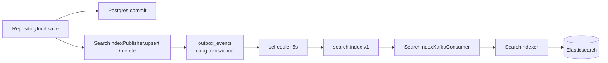

# Hạ tầng — Elasticsearch

> `shared-infrastructure/infra/search` + bốn adapter tìm kiếm trong ba module
> Cơ chế đọc/ngã về đã mô tả ở [iam-06](iam-06-tim-kiem-nguoi-dung.md); file này nói về **hạ tầng dùng chung**.

---

## 1. Bốn index, một triết lý

```
pwb_users · pwb_songs · pwb_voice_tags · pwb_rooms
```

Tiền tố `pwb` (`pwb.search.index-prefix`), kèm comment: một cluster phục vụ được nhiều môi trường **miễn là chúng không dùng chung tiền tố**.

Triết lý xuyên suốt, và mọi quyết định dưới đây đều là hệ quả của nó:

> **Elasticsearch là tiện ích, không phải sự thật.** Không dữ liệu nào tồn tại duy nhất ở đây. Mất cả cluster thì dựng lại được từ Postgres, và trong lúc chưa dựng lại thì tìm kiếm vẫn chạy — chỉ kém thông minh hơn.

Ba tầng bảo vệ dựng nên triết lý ấy, và chúng nhất quán với nhau:

| Tầng | Cấu hình | Hiệu quả |
|---|---|---|
| Timeout ngắn | `connection-timeout: 1s`, `socket-timeout: 2s` | Cluster chậm không giữ luồng Tomcat |
| Ngã về Postgres | `Optional.empty()` từ port | Tìm kiếm vẫn trả kết quả |
| Không tính vào sức khoẻ | `management.health.elasticsearch.enabled: false` | Container không bị thay thế |

Comment trong `application.yml` giải thích tầng đầu: *một request tìm kiếm giữ một Tomcat worker suốt thời gian nó chờ, nên một cluster chậm sẽ xếp hàng cả việc vào phòng lẫn điều khiển nhạc phía sau. Bỏ cuộc nhanh và trả lời từ Postgres là lựa chọn tốt hơn hẳn.*

---

## 2. Ghi index: qua outbox, không bao giờ trực tiếp



Đây là nguồn phát sự kiện lớn nhất của hệ thống: **75 trong 83 dòng outbox**.

Điểm cốt lõi nằm ở chỗ `SearchIndexPublisher` **nuốt lỗi**:

```java
/**
 * A search index that falls behind is a degraded search, not a failed write. Serialisation problems
 * are therefore logged rather than thrown — letting one bubble up would abort the transaction of the
 * business operation that triggered it.
 */
try {
    outboxEnqueueHelper.enqueue(topicProperties.getSearchIndex(), AGGREGATE_TYPE, event.docId(), …);
} catch (Exception ex) {
    log.warn("SEARCH.enqueue failed: index={} id={} action={} reason={}", …);
}
```

Ưu tiên rõ ràng: **cứ lưu người dùng, index lệch thì sửa sau bằng reindex.**

Chú ý chỗ gọi: `SongRepositoryImpl` và `VoiceTagRepositoryImpl` đều có comment *"The search index is refreshed from the saved aggregate, not the incoming one"* — index từ **thực thể đã lưu**, không phải thực thể truyền vào. Chỉ bản đã lưu mới mang id do database sinh và mọi giá trị mặc định.

Tắt hẳn bằng `pwb.search.enabled: false`: không dòng outbox nào được ghi, và consumer cũng không khởi động (`@ConditionalOnProperty`).

---

## 3. Consumer: phân biệt lỗi thử lại được và lỗi không

```java
/**
 * A payload that cannot be parsed will never parse on a retry, so it is raised as a non-retryable
 * failure and routed straight to the dead-letter topic.
 */
throw new SearchIndexPayloadException(…);
```

`SearchIndexPayloadException` nằm trong danh sách `addNotRetryableExceptions` của [cấu hình Kafka chung](infra-01-outbox-va-kafka.md). Phân biệt này là cốt lõi:

- **JSON hỏng** → thử lại 100 lần cũng hỏng → thẳng `search.index.v1.DLT`
- **ES không trả lời** → lần sau có thể được → thử lại theo backoff

Không phân biệt thì một payload hỏng chặn cứng cả partition, hoặc một sự cố mạng thoáng qua bị vứt vào DLT oan.

---

## 4. Khởi tạo index lúc khởi động

`SearchIndexBootstrapper` chạy khi `ApplicationReadyEvent`, tạo mọi index còn thiếu — ghép **mapping của từng module** với **settings analyzer dùng chung** (`search/index-settings.json`).

Tách hai thứ là đúng chỗ: analyzer (tách từ, chữ thường, bỏ dấu) giống nhau cho mọi index; còn trường nào tồn tại thì mỗi module tự biết.

### 4.1. Báo động khi không kết nối được

Đây là phần đáng đọc nhất của file, vì nó tồn tại để chữa một vấn đề chẩn đoán:

```java
/**
 * … Postgres, {@code /actuator/health} stays UP because the Elasticsearch health indicator is
 * switched off … the most likely cause is the most boring one — {@code SPRING_ELASTICSEARCH_URIS}
 * left unset, so the backend …
 */
log.error("SEARCH.startup Elasticsearch UNREACHABLE: uris={} reason=ping returned false", uris);
```

Vấn đề: ba tầng bảo vệ ở mục 1 làm một cluster chết trở nên **hoàn toàn vô hình**. Tìm kiếm vẫn trả kết quả (từ Postgres), healthcheck vẫn UP, không có gì đỏ ở đâu cả. Nguyên nhân thường gặp nhất lại là cái nhàm nhất — quên đặt biến môi trường.

Nên `logReachability` ping lúc khởi động và **ghi `error` nếu không tới được**, dù không chặn khởi động. Đây là chỗ duy nhất nói cho bạn biết sự thật.

### 4.2. Vì sao `ping` chứ không phải `cluster().health()`

Comment giải thích trực tiếp — và nó khớp với một vấn đề đã biết của dự án:

> *`ping` rather than `cluster().health()`, and reporting only rather than gating … decode after a perfectly good `200`. `ping` is a HEAD whose answer is the status code*

Client Elasticsearch trong `pom.xml` **mới hơn server đang chạy** (server là `elasticsearch:8.12.0`). Với API có kiểu, một client mới hơn có thể **thất bại khi giải mã một response 200 hoàn toàn hợp lệ**, vì nó mong những trường mà phiên bản server cũ không trả về.

`ping` là một HEAD request mà câu trả lời **chính là mã trạng thái** — không có thân response để giải mã, nên không có gì để lệch phiên bản. Chọn API đơn giản nhất là cách né toàn bộ lớp vấn đề đó.

Đây là bài học chung: **khi client và server lệch phiên bản, ưu tiên API ít cấu trúc nhất.**

---

## 5. Đọc: ES xếp hạng, Postgres cấp dữ liệu

Cơ chế đầy đủ ở [iam-06 §3–4](iam-06-tim-kiem-nguoi-dung.md). Tóm tắt phần dùng chung cho cả bốn index:

```java
Optional<SearchHitIds> hits = port.search(criteria, offset, size);
if (hits.isEmpty()) return searchInDatabase(criteria, pageable);   // engine không trả lời được
```

`Optional.empty()` nghĩa là *"không trả lời được"*, khác hẳn *"không có kết quả"* — kiểu dữ liệu phân biệt được hai chuyện.

ES chỉ trả về **danh sách id theo thứ hạng**; nội dung lấy từ Postgres. Nên index lệch không bao giờ khiến người dùng thấy dữ liệu cũ, chỉ khiến thứ tự hơi lệch.

Và cái bẫy đi kèm, mà `SongSearchUseCaseImpl` ghi rõ:

> *The database returns them in its own order, so the ranking is re-applied here — losing it would leave a "most relevant first" list sorted by nothing in particular.*

Phải duyệt theo `hits.ids()` rồi tra map, không duyệt theo kết quả database. Quên là mất toàn bộ công xếp hạng, mà danh sách vẫn trông hợp lệ nên bug rất khó nhận ra.

---

## 6. Reindex

`POST /admin/search/reindex` dựng lại từ Postgres — **cách sửa mọi lệch lạc**: mất do `enqueue` nuốt lỗi, payload rơi vào DLT, hay cluster bị xoá.

```yaml
pwb.search:
  bulk-size: 100
  reindex-page-size: 200
```

`GET /admin/search/indices` xem trạng thái. Cả hai nằm dưới `/api/v1/admin/**` nên chỉ ADMIN gọi được.

---

## 7. Quyết định & đánh đổi

| Quyết định | Thay vì | Vì sao | Cái giá |
|---|---|---|---|
| ES là tiện ích, không phải sự thật | Nguồn dữ liệu chính | Mất cluster không mất dữ liệu | Luôn phải có đường ngã về song song |
| Ghi index qua outbox | Ghi thẳng trong use case | Không mất sự kiện, không kéo ES vào transaction | Index luôn trễ vài giây |
| `enqueue` nuốt lỗi | Ném lên trên | Tìm kiếm lỗi không làm hỏng nghiệp vụ | Mất index âm thầm |
| Timeout 1s/2s | Chờ lâu hơn | Không xếp hàng Tomcat sau cluster chậm | Cluster hơi chậm là mất xếp hạng |
| ES không tính vào healthcheck | Tính như phụ thuộc bắt buộc | Container không bị thay thế vì thứ có đường dự phòng | Cluster chết trở nên vô hình |
| Log `error` lúc khởi động nếu không tới được | Chỉ dựa vào healthcheck | Bù lại đúng cái vô hình vừa tạo ra | Chỉ báo một lần lúc khởi động |
| `ping` thay vì `cluster().health()` | API có kiểu | Không có thân response để lệch phiên bản | Biết ít thông tin hơn về cluster |
| Index từ **thực thể đã lưu** | Từ thực thể truyền vào | Chỉ bản đã lưu có id và giá trị mặc định | — |
| ES xếp hạng, Postgres cấp dữ liệu | Đọc thẳng document ES | Không hiển thị bản sao cũ | Thêm một truy vấn mỗi trang |
| Analyzer chung, mapping riêng | Mỗi index tự lo hết | Cách tách từ nhất quán | Đổi analyzer phải reindex tất cả |
| Tiền tố `pwb` cho index | Không tiền tố | Nhiều môi trường chung một cluster | Phải nhớ đặt khác nhau |

---

## 8. Tự kiểm chứng

**Xem bốn index và số document:**

```bash
curl -s "http://localhost:9200/_cat/indices?h=index,docs.count,store.size&s=index"
```

> Chụp thật: `pwb_rooms` 5 · `pwb_songs` 6 · `pwb_users` 7 · `pwb_voice_tags` 2 — khớp với số hàng trong Postgres.

**Đối chiếu với Postgres** — hai con số phải khớp:

```bash
docker exec -e PGPASSWORD="$(grep -E '^POSTGRES_PASSWORD=' .env | cut -d= -f2-)" pwb-postgres psql -U pwb_user -d pwb_db -t -A -c "SELECT count(*) FROM iam_users WHERE NOT deleted;"
```

```bash
curl -s "http://localhost:9200/pwb_users/_count?pretty"
```

Lệch nghĩa là index đã mất sự kiện ở đâu đó — lúc ấy dùng `reindex`.

**Xem analyzer đang dùng:**

```bash
curl -s "http://localhost:9200/pwb_songs/_settings?pretty" | head -40
```

**Thấy đường đồng bộ chạy** — đổi tên một bài hát, rồi trong ~5 giây:

```bash
docker exec -e PGPASSWORD="$(grep -E '^POSTGRES_PASSWORD=' .env | cut -d= -f2-)" pwb-postgres psql -U pwb_user -d pwb_db -c "SELECT event_type, status, created_at FROM outbox_events WHERE event_type='SearchIndexPersisted' ORDER BY created_at DESC LIMIT 3;"
```

Rồi tìm tên mới trong `pwb_songs`.

**Thấy cả ba tầng bảo vệ cùng lúc** — thí nghiệm đáng làm nhất:

```bash
docker stop pwb-elasticsearch
```

Ba điều xảy ra đồng thời:

1. `GET /songs/search` vẫn **200**, kết quả từ Postgres, log có `SEARCH.songs fallback to database`
2. `GET /actuator/health` vẫn **UP**
3. Ghi dữ liệu mới vẫn thành công, dòng outbox vẫn được tạo và gửi (consumer sẽ hỏng rồi thử lại)

Không có gì đỏ ở đâu — chính là sự vô hình mà mục 4.1 nói tới.

Khởi động lại backend trong lúc ES vẫn tắt: log sẽ có dòng `SEARCH.startup Elasticsearch UNREACHABLE` — **chỗ duy nhất nói sự thật**.

```bash
docker start pwb-elasticsearch
```

**Xem hàng chết của index:**

```bash
docker exec pwb-kafka kafka-run-class kafka.tools.GetOffsetShell --bootstrap-server localhost:9092 --topic search.index.v1.DLT
```

---

## 9. Giới hạn hiện tại

| Giới hạn | Chi tiết |
|---|---|
| **Cluster chết gần như vô hình** | Chỉ một dòng log lúc khởi động; không cảnh báo, không chỉ số — mục 4.1 |
| Mất index âm thầm | `enqueue` nuốt lỗi, chỉ log warn — mục 2 |
| Index luôn trễ vài giây | Chu kỳ outbox |
| Không có công cụ đối chiếu | Phải tự so `_count` với `count(*)`; không có job kiểm tra định kỳ |
| Reindex không có tiến độ | Gọi xong không biết chạy tới đâu, xong chưa |
| Bộ lọc tồn tại hai bản | Specification cho Postgres và truy vấn ES phải giữ khớp bằng tay |
| Client mới hơn server | Buộc phải né API có kiểu ở đường kiểm tra — mục 4.2; có thể còn chỗ khác chưa lộ |
| Đổi analyzer phải reindex tất cả | Không có migration cho mapping |
| Không có tìm kiếm công khai | Chỉ admin tìm user, và mỗi người tìm nhạc của chính mình |
