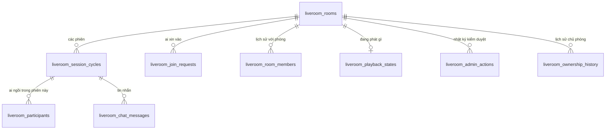

# Live Room — Tour

> Module nặng nhất: **9 trong 17 bảng nghiệp vụ**, 23 endpoint REST, 11 destination STOMP, 28 loại sự kiện, 4 scheduler.
> Tầng vận chuyển đã có file riêng: [13 — Realtime STOMP](13-realtime-stomp.md). File này nói về **nghiệp vụ chạy trên đó**.
> Chi tiết: [vòng đời phòng](liveroom-01-vong-doi-phong.md) · [vào phòng](liveroom-02-vao-phong.md) · [người tham gia](liveroom-03-nguoi-tham-gia.md) · [chat](liveroom-04-chat.md) · [nghe nhạc cùng](liveroom-05-nghe-nhac-cung.md) · [WebRTC](liveroom-06-webrtc.md) · [scheduler](liveroom-07-scheduler.md)

---

## 1. Live Room làm gì

Chủ phòng mở một phòng, gửi mã 6 ký tự cho khách. Khách xin vào, chủ duyệt. Trong phòng: gọi video, chat, và **nghe cùng một bài hát đồng bộ tới từng giây**, bình luận ghim vào giây thứ mấy của bài.

Điều khiến module này khó không phải danh sách tính năng, mà là **trạng thái chia sẻ giữa nhiều người trong thời gian thực**. Mỗi thay đổi phải: ghi vào database, phát tới mọi trình duyệt trong phòng, và không mâu thuẫn khi hai người bấm cùng lúc.

---

## 2. Chín bảng, và vì sao cần nhiều đến thế



Ba bảng dễ nhầm lẫn nhất, và phân biệt được chúng là hiểu được nửa module:

| Bảng | Phạm vi | Trả lời câu hỏi |
|---|---|---|
| `liveroom_participants` | **Một phiên** (`cycle_id`) | Ai đang ngồi trong phòng lúc này? |
| `liveroom_room_members` | **Cả đời phòng** (`room_id`) | Người này từng được duyệt chưa? Có đang bị phạt không? |
| `liveroom_join_requests` | Một lần xin vào | Yêu cầu này đã được quyết chưa? |

`room_members` là bảng đáng chú ý nhất. Nó gộp bốn thứ vào một hàng khoá `(room_id, user_id)`:

```
was_approved              đã từng được duyệt vào phòng này
kicked_at + kicked_cooldown_until    đang bị phạt sau khi bị đuổi
reject_count_by_owner     chủ phòng đã từ chối bao nhiêu lần
reject_count_by_capacity  bị từ chối vì phòng đầy bao nhiêu lần
```

Bốn thứ này lẽ ra là bốn bảng, nhưng **cùng được đọc bởi một phép kiểm duy nhất** ở cửa vào phòng, nên tách ra chỉ tốn thêm phép join.

---

## 3. Session cycle — khái niệm phải nắm trước mọi thứ khác

Một phòng có thể **kết thúc rồi mở lại**. Mỗi lần mở là một **phiên** mới (`liveroom_session_cycles`), và phần lớn dữ liệu gắn với **phiên**, không gắn với **phòng**:

```
phòng (room)          tồn tại lâu dài, giữ mã phòng, tên, sức chứa, lịch sử thành viên
  └─ phiên (cycle)    một buổi họp cụ thể
       ├─ participants   ai ngồi trong buổi này
       └─ chat messages  tin nhắn của buổi này
```

Vì sao quan trọng: mở lại phòng cũ **không** kéo theo người và tin nhắn của buổi trước. Chúng thuộc về phiên đã đóng. Nhưng `room_members` thì **có** — nên người đã được duyệt lần trước vào thẳng, không phải xin lại.

Đây cũng là lý do gần như mọi truy vấn trong module đều dùng `cycleId`, không dùng `roomId`.

---

## 4. Bảy khuôn mẫu lặp lại khắp module

### 4.1. Khoá hàng phòng trước khi đổi sức chứa

```java
LiveRoom room = liveRoomRepository.findByIdForUpdate(roomId)
```

`findByIdForUpdate` (khoá bi quan, `SELECT … FOR UPDATE`) xuất hiện ở **mọi** thao tác đụng tới `current_participant_count`: vào phòng, duyệt yêu cầu, kick, kết thúc, undo.

Không khoá thì hai người vào phòng cùng lúc đều đọc thấy "còn 1 chỗ" và cả hai đều vào — phòng vượt sức chứa.

Chú ý sự tương phản: sức chứa dùng **khoá bi quan**, còn phát nhạc dùng **khoá lạc quan** (`version`). Lý do ở [liveroom-05 §5](liveroom-05-nghe-nhac-cung.md).

### 4.2. Hai cửa vào phòng, và cái bẫy đi kèm

Người ta vào phòng bằng **hai đường hoàn toàn khác nhau**:

| Đường | Ai đi | Use case |
|---|---|---|
| Cửa trước | Chủ phòng, hoặc người đã từng được duyệt | `JoinRoomUseCase` |
| Cửa sau | Người vừa được chủ phòng bấm duyệt | `ApproveJoinRequestUseCase` → `admissions.admit` **trực tiếp** |

Người được duyệt **không đi qua `JoinRoomUseCase`**. Họ đã ở trong phòng ngay khi chủ bấm nút.

**Đây là cái bẫy lớn nhất của module.** Bất cứ thứ gì phải xảy ra "khi có người vào phòng" đều phải móc vào **cả hai chỗ**. Một tính năng từng quên đúng điều này và để người được duyệt giữa bài hát trở thành người duy nhất trong phòng không nghe thấy gì — chỉ lộ ra khi chạy client thật.

Thấy rõ trong code: cả hai use case đều gọi `playbacks.sendCurrentTo(...)`, `RoomEvents.participantJoined`, `capacityChanged`, `capacityReached` — bốn dòng gần như y hệt, lặp ở hai chỗ.

### 4.3. Sự kiện luôn phát sau commit

`LiveroomEventPublisher` hoãn mọi lần gửi tới `afterCommit`. Kèm theo là quy tắc **không bao giờ hoãn hai lần** — use case cứ gọi thẳng, đừng tự bọc thêm callback commit. Chi tiết và lý do ở [13 §6](13-realtime-stomp.md).

### 4.4. Quyết định riêng tư đi kênh riêng

| Loại | Đi đâu |
|---|---|
| Ai đó vào/ra/bị kick, đổi sức chứa | `/topic/liveroom/{roomId}` — cả phòng |
| Chat | `/topic/liveroom/{roomId}/chat` |
| Nhạc, bình luận theo timeline | `/topic/liveroom/{roomId}/music` |
| **Yêu cầu của bạn bị từ chối** | `/user/queue/liveroom` — chỉ bạn |
| **Tín hiệu WebRTC** | `/user/queue/liveroom/rtc` — chỉ người nhận |
| Lỗi frame | `/user/queue/liveroom/errors` |

Việc chủ phòng từ chối ai đó **là chuyện giữa hai người**, không phát ra phòng. Tín hiệu WebRTC đi kênh riêng vì lý do bảo mật cứng hơn — xem [liveroom-06 §3](liveroom-06-webrtc.md).

### 4.5. Hình phạt là dấu thời gian, không phải cờ

Ba loại "đang bị hạn chế" đều lưu bằng **thời điểm hết hạn**, không phải boolean:

| Hạn chế | Cột | Mặc định |
|---|---|---|
| Bị kick, chưa được vào lại | `kicked_cooldown_until` | 5 phút |
| Bị chủ tắt mic, chưa được bật lại | `mic_unmute_cooldown_until` | 30 giây |
| Chủ phòng vắng mặt | `owner_left_at` + `owner_grace_seconds` | 60 giây |

Lưu deadline thay vì cờ có ba cái lợi: không cần job nào chạy để gỡ cờ, so sánh với `now()` là biết ngay, và **hạn chế sống sót qua việc thoát ra vào lại**.

Điểm cuối quan trọng: cooldown tắt mic được quyết **chỉ dựa trên deadline, không dựa trên trạng thái mic**. Nếu dựa vào trạng thái thì bất kỳ thay đổi nào đưa mic về "tắt" cũng chuyển sang "tự tắt", và từ đó bật lại được ngay — lách được hình phạt.

### 4.6. Kết thúc phòng là một thủ tục, không phải một cột

`RoomTermination.terminate` làm sáu việc theo thứ tự:

```java
closeOccupants(cycleId, at);        // 1 · mọi người ra khỏi phòng
expirePendingRequests(roomId, at);  // 2 · yêu cầu đang chờ hết hiệu lực
playbacks.freezeOnRoomEnd(room, at);// 3 · nhạc TẠM DỪNG, không xoá
trackCommentStore.clearCycle(cycleId); // 4 · bình luận timeline bay hết
room.end(reason, at);               // 5
sessionCycleStarter.close(...);     // 6 · đóng phiên
```

Bước 3 và 4 trái ngược nhau, và cả hai đều cố ý — xem [liveroom-01 §4](liveroom-01-vong-doi-phong.md).

### 4.7. Mọi giới hạn đều nằm trong một class cấu hình

`LiveroomConfig` gom tám nhóm: `room`, `codeLookup`, `moderation`, `chat`, `music`, `comments`, `rtc`, `realtime`. Đọc một file là thấy hết mọi con số của module:

| | Giá trị |
|---|---|
| Sức chứa mặc định | **7** người |
| Cửa sổ undo kết thúc | **5** giây |
| Chờ chủ phòng quay lại | **60** giây (đặt được khi tạo phòng) |
| Phòng rỗng bao lâu thì tự đóng | **5** phút |
| Chống dò mã phòng | **20** lần / **15** phút |
| Cooldown sau khi bị kick | **5** phút |
| Cooldown bật lại mic | **30** giây |
| Giữ chat | **90** ngày |
| Thời hạn URL nhạc | **1** giờ |
| Bình luận timeline | ≤**200** ký tự, ≤**200** bình luận/bài |
| SDP / ICE candidate | ≤**16384** / ≤**1024** ký tự |

---

## 5. Câu chuyện, theo thứ tự xảy ra

| Chặng | Nội dung | File |
|---|---|---|
| 1 | Tạo phòng, mã phòng, phiên, kết thúc/undo/mở lại | [liveroom-01](liveroom-01-vong-doi-phong.md) |
| 2 | Xin vào, duyệt, từ chối, khoá sau 3 lần từ chối | [liveroom-02](liveroom-02-vao-phong.md) |
| 3 | Rời phòng, chủ vắng mặt, kick, tắt mic, camera | [liveroom-03](liveroom-03-nguoi-tham-gia.md) |
| 4 | Chat | [liveroom-04](liveroom-04-chat.md) |
| 5 | Nghe nhạc đồng bộ, bình luận theo timeline | [liveroom-05](liveroom-05-nghe-nhac-cung.md) |
| 6 | Gọi video mesh | [liveroom-06](liveroom-06-webrtc.md) |
| 7 | Bốn scheduler chạy nền | [liveroom-07](liveroom-07-scheduler.md) |

---

## 6. Tự kiểm chứng

**Xem toàn cảnh một phòng:**

```bash
docker exec -e PGPASSWORD="$(grep -E '^POSTGRES_PASSWORD=' .env | cut -d= -f2-)" pwb-postgres psql -U pwb_user -d pwb_db -c "SELECT room_code, room_name, status, current_participant_count || '/' || max_participants AS nguoi, reopened_count AS so_lan_mo_lai, owner_left_at IS NOT NULL AS chu_dang_vang FROM liveroom_rooms;"
```

**Thấy phiên tách khỏi phòng:**

```bash
docker exec -e PGPASSWORD="$(grep -E '^POSTGRES_PASSWORD=' .env | cut -d= -f2-)" pwb-postgres psql -U pwb_user -d pwb_db -c "SELECT r.room_code, c.cycle_number, c.started_at, c.ended_reason FROM liveroom_session_cycles c JOIN liveroom_rooms r ON r.id = c.room_id ORDER BY r.room_code, c.cycle_number;"
```

**Thấy `room_members` giữ bốn thứ cùng lúc:**

```bash
docker exec -e PGPASSWORD="$(grep -E '^POSTGRES_PASSWORD=' .env | cut -d= -f2-)" pwb-postgres psql -U pwb_user -d pwb_db -c "SELECT was_approved, kicked_cooldown_until, reject_count_by_owner, reject_count_by_capacity FROM liveroom_room_members;"
```

Tạo phòng cần tài khoản **PRO**:

```bash
T=$(curl -s -X POST http://localhost:8080/api/v1/auth/login -H "Content-Type: application/json" -d '{"email":"pro1@gmail.com","password":"@NamHoang511"}' | grep -o '"accessToken":"[^"]*' | cut -d'"' -f4)
```

```bash
curl -s -X POST http://localhost:8080/api/v1/liveroom/rooms -H "Authorization: Bearer $T" -H "Content-Type: application/json" -d '{"roomName":"Phong thu nghiem"}'
```

---

## 7. Live Room khác hai module kia ở đâu

| | IAM | Audio | Live Room |
|---|---|---|---|
| Bảng nghiệp vụ | 5 | 3 | **9** |
| Use case | 26 | 4 interface | **31** |
| Lớp `application/support` | 4 | 3 | **17** |
| Giao thức | REST | REST | REST **+ STOMP** |
| Scheduler | 0 | 0 | **4** |
| Khoá đồng thời | không | không | **bi quan + lạc quan** |

Con số 17 lớp `support` là dấu hiệu rõ nhất: nghiệp vụ ở đây phức tạp tới mức phải tách những mảnh dùng chung (`Admissions`, `RoomTermination`, `Playbacks`, `RoomMembers`, `RoomSessions`…) ra khỏi use case, nếu không mỗi use case sẽ tự viết lại cùng một logic — và **hai cửa vào phòng** ở §4.2 cho thấy điều gì xảy ra khi có chỗ quên.

Module này cũng là module **duy nhất không có comment trong code** — theo chủ ý; phần lý giải nằm ở tài liệu kế hoạch và ở chính bộ tài liệu này.
