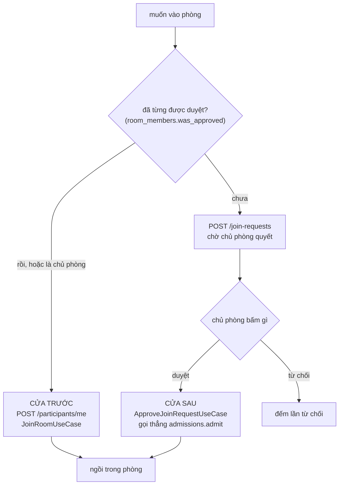

# Live Room — Vào phòng

> `POST /rooms/{id}/participants/me` (vào thẳng) · `POST|GET|DELETE /rooms/{id}/join-requests` · `GET .../me` · `POST .../{requestId}/approve|reject`
> Bối cảnh: [Live Room — Tour](liveroom-00-tour.md)

---

## 1. Bài toán

Phòng là riêng tư. Người lạ biết mã phòng vẫn phải xin phép, và chủ phòng quyết định. Nhưng đơn giản hoá tới mức "ai vào cũng phải xin" thì sai: người đã được duyệt hôm qua mà hôm nay phải xin lại là phiền vô lý.

Thêm ba việc phải xử lý:

1. Người bị từ chối liên tục xin lại — phải có trần
2. Chủ phòng bấm duyệt đúng lúc phòng vừa đầy — không được rollback mất quyết định
3. Mạng chập, client gửi lại request tạo yêu cầu — không được sinh hai yêu cầu

---

## 2. Hai cửa vào phòng

Đây là kiến trúc quan trọng nhất của module, đã nêu ở [tour §4.2](liveroom-00-tour.md):



Người được duyệt **không bao giờ chạm vào `JoinRoomUseCase`**. Cả hai đường đều kết thúc ở `Admissions.admit`, nhưng bốn việc sau khi ngồi xuống thì **mỗi use case tự làm lấy**:

```java
playbacks.sendCurrentTo(userId, room, now);                        // gửi trạng thái nhạc hiện tại
eventPublisher.broadcastToRoom(RoomEvents.participantJoined(...));
eventPublisher.broadcastToRoom(RoomEvents.capacityChanged(room));
if (!room.hasFreeSlot()) eventPublisher.broadcastToRoom(RoomEvents.capacityReached(room));
```

Bốn dòng này **lặp nguyên văn ở cả hai use case**. Đó vừa là sự trùng lặp, vừa là chỗ dễ quên nhất trong module — thêm một việc "khi có người vào phòng" mà chỉ sửa một chỗ là tạo ra bug chỉ lộ với người vào bằng cửa còn lại.

Đưa bốn dòng đó vào `Admissions.admit` sẽ chữa được, nhưng `admit` hiện là hàm thuần về xếp chỗ, không phát sự kiện.

---

## 3. Cửa trước: `JoinRoomUseCase`

```java
LiveRoom room = liveRoomRepository.findByIdForUpdate(roomId)  // khoá bi quan
…
if (!isOwner) {
    if (member.isServingKickCooldown(now)) throw … KICKED_COOLDOWN;
    if (!member.wasApproved())             throw … APPROVAL_REQUIRED;
} else if (room.isOwnerAbsent()) {
    room.markOwnerReturned();
    ownerReturning = true;
}
```

Ba nhánh:

- **Đang bị phạt sau khi bị kick** → `KICKED_COOLDOWN`, kèm số phút còn lại (làm tròn lên, tối thiểu 1)
- **Chưa từng được duyệt** → `APPROVAL_REQUIRED`, tức là phải đi đường xin phép
- **Là chủ phòng và đang vắng mặt** → quay lại, huỷ đồng hồ đếm ngược ([liveroom-03 §3](liveroom-03-nguoi-tham-gia.md))

Chủ phòng **không bị hai phép kiểm đầu**. Không ai kick được chủ phòng, và chủ phòng không cần tự duyệt mình.

`findByIdForUpdate` khoá hàng phòng suốt transaction. Cần thiết vì `admissions.admit` đọc `hasFreeSlot()` rồi tăng `current_participant_count` — hai thao tác phải nguyên tử, nếu không hai người vào cùng lúc đều thấy chỗ trống cuối cùng.

---

## 4. Xin vào phòng

```java
var replay = joinRequestRepository.findByRoomIdAndUserIdAndIdempotencyKey(
        room.getId(), command.actor().userId(), command.idempotencyKey());
if (replay.isPresent()) {
    return viewFactory.toView(replay.get(), member);   // trả lại y nguyên, không tạo mới
}
```

**Khoá idempotency** là thứ đầu tiên được kiểm. Client gửi lại cùng một khoá (do mạng chập, do bấm hai lần) sẽ nhận lại **đúng yêu cầu cũ**, không sinh yêu cầu thứ hai. Khoá được dọn sau 24 giờ bởi một scheduler ([liveroom-07](liveroom-07-scheduler.md)).

Sau đó năm phép kiểm, theo thứ tự:

| Kiểm | Lỗi | Ý nghĩa |
|---|---|---|
| Phòng còn hoạt động | `ROOM_ENDED` | |
| Không phải chủ phòng tự xin | `SELF_JOIN_NOT_ALLOWED` | |
| Không đang bị phạt kick | `KICKED_COOLDOWN` | Bị đuổi thì không xin lại ngay được |
| **Chưa bị khoá** | `REQUEST_LOCKED` | Đã bị từ chối 3 lần |
| Chưa từng được duyệt | `ALREADY_APPROVED` | Đã duyệt rồi thì đi cửa trước |
| Không có yêu cầu đang chờ | `DUPLICATE_REQUEST` | Một người một yêu cầu |

Chú ý `ALREADY_APPROVED` là **lỗi**, không phải đường tắt. Hệ thống không tự chuyển bạn sang cửa trước; nó bảo bạn đi nhầm cửa.

Yêu cầu được tạo xong thì **phát ra cả phòng**, không chỉ cho chủ phòng — `broadcastToRoom(RoomEvents.joinRequestCreated(...))`, kèm `avatarUrl` để client dựng được ô hiển thị mà không phải gọi thêm API.

---

## 5. Từ chối, và cái trần ba lần

```java
request.rejectByOwner(actorId, Instant.now());
member.recordOwnerRejection();

int attemptsRemaining = Math.max(RoomMember.REJECT_LIMIT - member.getRejectCountByOwner(), 0);
eventPublisher.sendToUser(rejected.getUserId(),
        RoomEvents.requestRejectedByOwner(rejected, member.getRejectCountByOwner(), attemptsRemaining));
if (member.isLockedOut()) {
    eventPublisher.sendToUser(rejected.getUserId(), RoomEvents.requestLocked(...));
}
```

`REJECT_LIMIT = 3`, hằng số trong domain model. Quá ba lần thì `isLockedOut()` trả true và mọi yêu cầu sau đó bị chặn ngay ở mục 4.

**Hai bộ đếm riêng biệt**, và đây là điểm thiết kế đáng chú ý:

| Bộ đếm | Tăng khi | Tính vào trần |
|---|---|---|
| `reject_count_by_owner` | Chủ phòng chủ động từ chối | ✅ |
| `reject_count_by_capacity` | Phòng đầy lúc chủ bấm duyệt | ❌ |

Bị từ chối vì phòng đầy **không phải lỗi của người xin**. Gộp hai bộ đếm sẽ khoá một người chỉ vì họ xui — xin vào ba lần đều đúng lúc phòng kín chỗ.

Sự kiện từ chối đi tới **kênh riêng của người xin** (`sendToUser`), không phát ra phòng. Việc chủ phòng từ chối ai là chuyện giữa hai người.

`attemptsRemaining` được tính sẵn ở server, không để client tự trừ — client không cần biết `REJECT_LIMIT` là bao nhiêu.

Người bị khoá nhận **hai** sự kiện liên tiếp: `REQUEST_REJECTED_BY_OWNER` rồi `REQUEST_LOCKED`. Tách ra để client hiển thị đúng: lần từ chối này, và tình trạng từ giờ trở đi.

> **Một điểm lệch với tài liệu yêu cầu:** tài liệu mô tả việc lưu một bản ghi yêu cầu ở trạng thái `LOCKED`. Cài đặt thì **không ghi hàng nào** — người bị khoá nhận lỗi ngay ở bước kiểm. Lý do: ghi một hàng `LOCKED` sẽ đẩy vào danh sách chờ của chủ phòng một quyết định mà hệ thống đã tự đưa ra rồi.

---

## 6. Duyệt — và ca khó nhất: phòng vừa đầy

```java
if (!room.hasFreeSlot()) {
    request.rejectByCapacity(actorId, now);
    JoinRequest settled = joinRequestRepository.save(request);
    member.recordCapacityRejection();
    roomMembers.save(member);
    eventPublisher.sendToUser(settled.getUserId(),
            RoomEvents.requestRejectedByCapacity(settled, member.getRejectCountByCapacity()));
    return viewFactory.toView(settled, member, avatarUrl);   // ← HTTP 200
}
```

Chủ phòng bấm duyệt, nhưng giữa lúc họ nhìn màn hình và lúc bấm, phòng đã đầy. Hệ thống **trả HTTP 200** với trạng thái `REJECTED_BY_CAPACITY`, không ném lỗi.

Vì sao không ném: ném exception sẽ **rollback chính thay đổi mà chủ phòng cần thấy**. Yêu cầu vẫn ở trạng thái `PENDING`, danh sách chờ không đổi, và chủ phòng bấm lại sẽ gặp đúng như vậy. Trả 200 với kết quả "đã quyết, nhưng kết quả là từ chối vì hết chỗ" là cách duy nhất khiến cả hai bên thấy sự thật.

Đây là ví dụ rõ nhất trong dự án về việc **HTTP 200 không có nghĩa là "điều bạn muốn đã xảy ra"**, mà là "yêu cầu của bạn đã được xử lý và đây là kết quả".

Đường duyệt thành công thì gọi thẳng `admissions.admit` — cửa sau ở mục 2.

---

## 7. Quyết định & đánh đổi

| Quyết định | Thay vì | Vì sao | Cái giá |
|---|---|---|---|
| Hai cửa vào phòng | Duyệt xong bắt gọi thêm `join` | Người được duyệt vào ngay, không phải bấm lần nữa | Bốn dòng lặp ở hai chỗ, dễ quên khi thêm tính năng |
| `was_approved` gắn với phòng | Gắn với phiên | Buổi sau vào thẳng | Duyệt một lần là vào được mãi mãi |
| Khoá bi quan cho sức chứa | Khoá lạc quan | Đếm chỗ phải chính xác tuyệt đối | Nối tiếp mọi thao tác vào/ra của một phòng |
| Khoá idempotency cho yêu cầu | Không có | Mạng chập không sinh hai yêu cầu | Thêm cột và một scheduler dọn dẹp |
| Hai bộ đếm từ chối riêng | Một bộ đếm | Xui vì phòng đầy không bị phạt | Thêm một cột |
| Khoá sau 3 lần, không ghi hàng `LOCKED` | Ghi hàng như tài liệu mô tả | Không đẩy quyết định đã có sẵn vào danh sách chờ của chủ phòng | Lệch tài liệu yêu cầu |
| Duyệt lúc phòng đầy → **200** `REJECTED_BY_CAPACITY` | Ném lỗi | Không rollback chính quyết định chủ phòng vừa đưa ra | Client phải đọc `state`, không được tin mã 200 |
| `ALREADY_APPROVED` là lỗi | Tự chuyển sang cửa trước | Mỗi endpoint làm đúng một việc | Client phải xử lý thêm một nhánh |
| Yêu cầu phát ra cả phòng, quyết định gửi riêng | Cả hai đều riêng | Ai cũng thấy có người đang chờ; ai bị từ chối thì chỉ mình biết | — |
| `attemptsRemaining` tính ở server | Client tự trừ | Client không cần biết trần là bao nhiêu | — |

---

## 8. Tự kiểm chứng

Cần hai tài khoản: `pro1@gmail.com` (chủ phòng) và `user1@gmail.com` (người xin vào).

```bash
TO=$(curl -s -X POST http://localhost:8080/api/v1/auth/login -H "Content-Type: application/json" -d '{"email":"pro1@gmail.com","password":"@NamHoang511"}' | grep -o '"accessToken":"[^"]*' | cut -d'"' -f4)
```

```bash
TU=$(curl -s -X POST http://localhost:8080/api/v1/auth/login -H "Content-Type: application/json" -d '{"email":"user1@gmail.com","password":"@NamHoang511"}' | grep -o '"accessToken":"[^"]*' | cut -d'"' -f4)
```

**Người chưa được duyệt thử vào thẳng:**

```bash
curl -s -X POST "http://localhost:8080/api/v1/liveroom/rooms/<roomId>/participants/me" -H "Authorization: Bearer $TU"
```

Nhận `APPROVAL_REQUIRED`.

**Xin vào, rồi gửi lại cùng khoá idempotency:**

```bash
curl -s -X POST "http://localhost:8080/api/v1/liveroom/rooms/<roomId>/join-requests" -H "Authorization: Bearer $TU" -H "Content-Type: application/json" -d '{"idempotencyKey":"key-thu-nghiem-001"}'
```

Gọi hai lần với cùng khoá: **cùng một `requestId`**, và bảng chỉ có một hàng.

**Từ chối ba lần và xem bộ đếm:**

```bash
docker exec -e PGPASSWORD="$(grep -E '^POSTGRES_PASSWORD=' .env | cut -d= -f2-)" pwb-postgres psql -U pwb_user -d pwb_db -c "SELECT reject_count_by_owner, reject_count_by_capacity, was_approved FROM liveroom_room_members;"
```

Sau lần thứ ba, yêu cầu mới nhận `REQUEST_LOCKED` và **không có hàng nào được thêm** vào `liveroom_join_requests` — đúng như mục 5.

**Xem hai cửa dẫn tới cùng một chỗ:**

```bash
docker exec -e PGPASSWORD="$(grep -E '^POSTGRES_PASSWORD=' .env | cut -d= -f2-)" pwb-postgres psql -U pwb_user -d pwb_db -c "SELECT p.user_email, p.room_role, p.state, p.joined_at FROM liveroom_participants p ORDER BY p.joined_at DESC LIMIT 10;"
```

Người vào bằng cửa trước và người được duyệt trông **giống hệt nhau** trong bảng này — đúng như thiết kế.

---

## 9. Giới hạn hiện tại

| Giới hạn | Chi tiết |
|---|---|
| **Bốn dòng "sau khi vào phòng" lặp ở hai use case** | Thêm tính năng mà quên một chỗ là bug chỉ lộ với một loại người dùng — mục 2 |
| Duyệt một lần là vào được mãi mãi | Không có API thu hồi `was_approved` |
| Khoá 3 lần là vĩnh viễn | Không có API gỡ khoá, không tự hết hạn — khác hẳn cooldown kick 5 phút |
| Chủ phòng không thấy ai đang bị khoá | `room_members` không có endpoint đọc |
| Không mời trước được | Chỉ có đường "xin rồi duyệt"; không tạo được lời mời chủ động |
| Yêu cầu đang chờ không tự hết hạn | Chỉ hết khi phòng kết thúc (`expirePendingRequests`) |
| Khoá bi quan nối tiếp mọi thao tác của một phòng | Với 7 người thì không sao; sức chứa lớn hơn thì đây là chỗ nghẽn đầu tiên |
