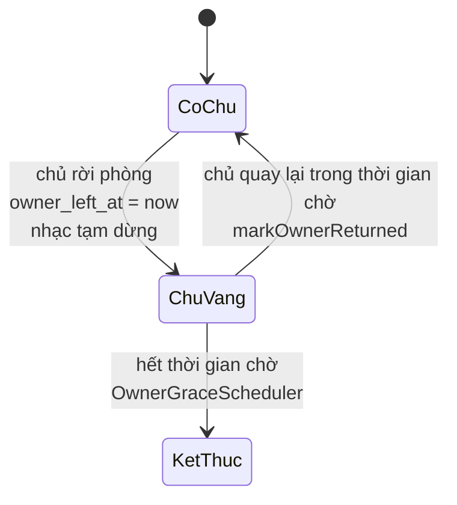

# Live Room — Người tham gia

> `DELETE /rooms/{id}/participants/me` · `GET /participants` · `PATCH /participants/me/media` · `POST /participants/{userId}/kick|mute`
> Bối cảnh: [Live Room — Tour](liveroom-00-tour.md)

---

## 1. Bài toán

Bốn thao tác trên cùng một bảng `liveroom_participants`, nhưng mỗi cái đụng vào một vấn đề khác:

| Thao tác | Vấn đề riêng |
|---|---|
| Rời phòng | **Chủ phòng rời thì phòng còn tồn tại không?** |
| Kick | Đuổi rồi phải cắt kết nối, và cấm quay lại một lúc |
| Tắt mic từ xa | Người bị tắt không được bật lại ngay |
| Bật/tắt camera, mic | Phải phân biệt "tự tắt" với "bị tắt" |

Vấn đề đầu là khó nhất, và nó đẻ ra khái niệm **owner grace**.

---

## 2. Rời phòng

```java
participant.leave(now);
room.releaseSlot();
boolean ownerLeaving = room.isOwnedBy(actorId);
if (ownerLeaving) {
    room.markOwnerLeft(now);
}
eventPublisher.broadcastToRoom(RoomEvents.participantLeft(room, left));
if (ownerLeaving) {
    playbacks.pauseForOwnerAbsence(room, now);
    ownerPresenceAnnouncer.ownerLeft(roomId);
}
eventPublisher.broadcastToRoom(RoomEvents.capacityChanged(room));
```

Người thường rời phòng: nhả một chỗ, phát sự kiện, hết.

Chủ phòng rời phòng thì thêm ba việc: đánh dấu `owner_left_at`, **tạm dừng nhạc**, và thông báo cho cả phòng.

---

## 3. Owner grace — chủ phòng vắng mặt

Nếu chủ phòng thoát là phòng đóng ngay thì một lần rớt mạng, một lần đóng nhầm tab, hay một lần chuyển từ wifi sang 4G cũng giết cả buổi họp. Nhưng để phòng sống mãi khi chủ đã bỏ đi thì phòng trở thành rác treo vô thời hạn.

Giải pháp: **đồng hồ đếm ngược**.



Ba con số điều khiển:

| Cấu hình | Mặc định | Vai trò |
|---|---|---|
| `owner_grace_seconds` (mỗi phòng) | 60 giây | Chờ bao lâu, đặt được khi tạo phòng |
| `room.owner-leave-debounce` | 3 giây | Chống rung khi chủ rời rồi vào lại ngay |
| `scheduler.owner-grace-interval-ms` | 10 giây | Tần suất scheduler quét |

Ba thứ xảy ra khi chủ vắng mặt:

**Nhạc tạm dừng, không tắt.** `playbacks.pauseForOwnerAbsence` — chủ quay lại thì bấm tiếp là chạy đúng chỗ. Kèm theo là một quy tắc: chỉ chủ phòng mới bắt đầu được audio ([liveroom-05 §4](liveroom-05-nghe-nhac-cung.md)), nên nhạc không tự chạy tiếp khi chủ đi vắng.

**Cả phòng được báo.** Client hiển thị đồng hồ đếm ngược, dùng đồng hồ server đã đồng bộ ([13 §9](13-realtime-stomp.md)) — nếu tính bằng đồng hồ máy người dùng thì mỗi người thấy một con số khác nhau.

**Chủ quay lại thì huỷ đồng hồ** — nằm ngay trong `JoinRoomUseCase`:

```java
} else if (room.isOwnerAbsent()) {
    room.markOwnerReturned();
    ownerReturning = true;
}
…
if (ownerReturning) ownerPresenceAnnouncer.ownerReturned(room, now);
```

Không có scheduler nào phải "huỷ" gì cả — nó chỉ quét những phòng còn `owner_left_at` khác null và đã quá hạn. Cùng khuôn "hình phạt là dấu thời gian" ở [tour §4.5](liveroom-00-tour.md): trạng thái tự biến mất, không cần ai dọn.

> `OWNER_REJOINED` là sự kiện từng **biến mất không dấu vết** vì lỗi hoãn-hai-lần — chi tiết ở [13 §6.1](13-realtime-stomp.md).

---

## 4. Kick

```java
if (command.actorId().equals(command.targetUserId())) throw … SELF_KICK_NOT_ALLOWED;
LiveRoom room = liveRoomRepository.findByIdForUpdate(command.roomId())…;
if (!room.isOwnedBy(command.actorId())) throw … ROOM_NOT_FOUND;
…
participant.kick(now);
room.releaseSlot();
member.recordKick(now, cooldownUntil);          // cooldownUntil = now + 5 phút
adminActionRepository.save(RoomAdminAction.record(… AdminActionType.KICK, reason, now));
eventPublisher.broadcastToRoom(RoomEvents.participantKicked(room, kicked, actorId, reason, cooldownUntil));
eventPublisher.broadcastToRoom(RoomEvents.capacityChanged(room));
```

Năm việc trong một transaction: đánh dấu người bị kick, nhả chỗ, ghi cooldown vào `room_members`, ghi nhật ký kiểm duyệt, phát sự kiện.

Rồi việc thứ sáu, **sau khi commit và trễ thêm 2 giây**: đóng WebSocket của họ. Toàn bộ cơ chế đó ở [13 §8](13-realtime-stomp.md) — Spring vứt bỏ frame `DISCONNECT` chiều server→client nên phải giữ được đối tượng `WebSocketSession`, và 2 giây là khoảng thở để sự kiện `PARTICIPANT_KICKED` kịp tới nơi trước khi kết nối đứt.

**Cooldown 5 phút** ghi vào `kicked_cooldown_until`. Nó chặn cả hai cửa vào phòng: `JoinRoomUseCase` và `CreateJoinRequestUseCase` đều kiểm `isServingKickCooldown`, và cả hai đều tính số phút còn lại theo cùng một công thức làm tròn lên.

Cooldown **sống sót qua việc thoát ra vào lại** vì nó là deadline trong database, không phải trạng thái phiên.

`liveroom_admin_actions` là bảng nhật ký cho cả kick lẫn tắt mic — thứ IAM **không có** cho các thao tác quản trị của nó ([iam-05 §9](iam-05-quan-tri-nguoi-dung.md)).

---

## 5. Ba trạng thái mic

Đây là chỗ tinh tế nhất của file này. Một cột boolean `mic_on` là không đủ, vì "mic đang tắt" có hai nghĩa hoàn toàn khác nhau:

| `MicState` | Nghĩa | Bật lại được không |
|---|---|---|
| `UNMUTED` | Đang bật | — |
| `SELF_MUTED` | Tự tắt | Ngay lập tức |
| `MUTED_BY_OWNER` | Bị chủ phòng tắt | Sau khi hết cooldown 30 giây |

Chủ phòng tắt mic của ai đó:

```java
participant.muteByOwner(now, now.plus(config.getModeration().getMicUnmuteCooldown()));
```

Ghi ba thứ: `mic_on = false`, `mic_state = MUTED_BY_OWNER`, `mic_unmute_cooldown_until = now + 30s`.

### 5.1. Vì sao cooldown phải dựa vào deadline, không dựa vào trạng thái

Đây là một cái bẫy thật, và cách chữa nằm ở đúng một dòng:

```java
if (micOn && participant.isMicUnmuteBlocked(now)) {
    throw new LiveroomBusinessException(LiveroomErrorCode.MIC_MUTE_COOLDOWN, Map.of("seconds", seconds));
}
```

Phép kiểm hỏi **deadline**, không hỏi `micState`.

Nếu hỏi `micState` thì có đường lách: người bị tắt mic gửi một cập nhật media bất kỳ khiến trạng thái chuyển sang `SELF_MUTED`, và từ đó bật lại ngay được — hình phạt biến mất sau một lượt đi vòng.

Thấy rõ trong domain model, dòng 198:

```java
this.micState = isMicUnmuteBlocked(at) ? MicState.MUTED_BY_OWNER : MicState.SELF_MUTED;
```

Trạng thái **tự tính lại từ deadline**, chứ không phải deadline suy ra từ trạng thái. Đảo chiều phụ thuộc là điều làm nó không lách được.

### 5.2. Cập nhật media là cập nhật một phần

```java
boolean cameraOn = command.cameraOn() != null ? command.cameraOn() : participant.isCameraOn();
boolean micOn    = command.micOn()    != null ? command.micOn()    : participant.isMicOn();
```

`null` nghĩa là "đừng đổi cái này". Client bật camera không phải gửi kèm trạng thái mic — tránh được ca hai thay đổi chồng lên nhau và cái sau ghi đè cái trước bằng dữ liệu cũ.

Sự kiện `MIC_UNMUTED` chỉ phát khi thực sự có chuyển tiếp từ bị-tắt sang bật:

```java
if (wasMutedByOwner && updated.isMicOn()) {
    eventPublisher.broadcastToRoom(RoomEvents.micUnmuted(room, updated, now));
}
```

Cả phòng vừa thấy chủ tắt mic một người, nên cần biết khi người đó được nói lại. Còn việc tự tắt tự bật thì chỉ là `MEDIA_STATE_CHANGED` bình thường.

---

## 6. Quyết định & đánh đổi

| Quyết định | Thay vì | Vì sao | Cái giá |
|---|---|---|---|
| Owner grace thay vì đóng ngay | Chủ rời là đóng phòng | Rớt mạng không giết buổi họp | Phòng có thể treo tới hết thời gian chờ |
| Thời gian chờ đặt theo từng phòng | Một giá trị chung | Buổi khác nhau cần khác nhau | Thêm một tham số khi tạo phòng |
| Nhạc tạm dừng khi chủ vắng | Cứ để chạy | Không ai nghe tiếp mà chủ không có mặt | Chủ quay lại phải bấm phát lại |
| Ba trạng thái mic | Một boolean | Phân biệt tự tắt và bị tắt | Thêm một cột, phải giữ đồng bộ với `mic_on` |
| Cooldown dựa **deadline**, không dựa trạng thái | Dựa `micState` | Không lách được bằng cách đổi trạng thái vòng vèo | Trạng thái phải tính lại từ deadline ở mọi chỗ ghi |
| Cooldown kick lưu ở `room_members` | Lưu ở `participants` | Sống sót qua việc rời phòng và qua cả phiên | Bảng `room_members` gánh thêm việc |
| Đóng WebSocket sau 2 giây | Đóng ngay | Người bị kick kịp biết lý do | Họ còn nghe được kênh phòng thêm 2 giây |
| Cập nhật media từng phần (`null` = giữ nguyên) | Gửi đủ mọi trường | Hai thay đổi song song không đè lên nhau | Client phải hiểu quy ước `null` |
| Nhật ký kiểm duyệt riêng | Chỉ log | Tra lại được ai đuổi ai, vì sao | Thêm một bảng |
| `SELF_KICK_NOT_ALLOWED` | Cho chủ tự kick | Chủ tự kick là tự khoá mình 5 phút khỏi phòng của mình | — |

---

## 7. Tự kiểm chứng

```bash
TO=$(curl -s -X POST http://localhost:8080/api/v1/auth/login -H "Content-Type: application/json" -d '{"email":"pro1@gmail.com","password":"@NamHoang511"}' | grep -o '"accessToken":"[^"]*' | cut -d'"' -f4)
```

**Xem ai đang trong phòng:**

```bash
curl -s "http://localhost:8080/api/v1/liveroom/rooms/<roomId>/participants" -H "Authorization: Bearer $TO"
```

**Xem ba trạng thái mic trong database:**

```bash
docker exec -e PGPASSWORD="$(grep -E '^POSTGRES_PASSWORD=' .env | cut -d= -f2-)" pwb-postgres psql -U pwb_user -d pwb_db -c "SELECT user_email, state, camera_on, mic_on, mic_state, mic_unmute_cooldown_until - now() AS cooldown_con_lai FROM liveroom_participants ORDER BY joined_at DESC LIMIT 10;"
```

**Thử lách cooldown tắt mic** — đây là thí nghiệm đáng làm nhất trong file:

1. Chủ phòng gọi `POST /participants/{userId}/mute`
2. Người bị tắt gọi `PATCH /participants/me/media` với `{"micOn": true}` → nhận `MIC_MUTE_COOLDOWN` kèm số giây
3. Thử đường vòng: gửi `{"cameraOn": true}` rồi lại `{"micOn": true}` → **vẫn** `MIC_MUTE_COOLDOWN`
4. Đợi hết 30 giây rồi thử lại → thành công, và cả phòng nhận `MIC_UNMUTED`

Bước 3 chính là đường lách mà thiết kế ở mục 5.1 chặn.

**Xem owner grace:**

```bash
curl -s -X DELETE "http://localhost:8080/api/v1/liveroom/rooms/<roomId>/participants/me" -H "Authorization: Bearer $TO"
```

```bash
docker exec -e PGPASSWORD="$(grep -E '^POSTGRES_PASSWORD=' .env | cut -d= -f2-)" pwb-postgres psql -U pwb_user -d pwb_db -c "SELECT room_code, status, owner_left_at, owner_grace_seconds FROM liveroom_rooms WHERE owner_left_at IS NOT NULL;"
```

Chủ vào lại trước khi hết giờ thì `owner_left_at` trở về null. Không vào lại thì sau khoảng 60 giây phòng chuyển `ENDED` với `ended_reason` do scheduler ghi ([liveroom-07](liveroom-07-scheduler.md)).

**Xem cooldown kick chặn cả hai cửa** — kick một người, rồi để họ thử cả `POST /participants/me` lẫn `POST /join-requests`. Cả hai nhận `KICKED_COOLDOWN` với cùng số phút.

**Xem nhật ký kiểm duyệt:**

```bash
docker exec -e PGPASSWORD="$(grep -E '^POSTGRES_PASSWORD=' .env | cut -d= -f2-)" pwb-postgres psql -U pwb_user -d pwb_db -c "SELECT action_type, reason, created_at FROM liveroom_admin_actions ORDER BY created_at DESC LIMIT 10;"
```

---

## 8. Giới hạn hiện tại

| Giới hạn | Chi tiết |
|---|---|
| Không chuyển được quyền chủ phòng | Bảng `liveroom_ownership_history` có `OwnershipChangeType`, nhưng chỉ ghi `INITIAL_CREATE` — cấu trúc đã sẵn, chưa có API |
| Chủ phòng rời là nhạc dừng cho mọi người | Không uỷ quyền điều khiển nhạc được |
| Không bỏ kick sớm được | Cooldown 5 phút cố định, chủ phòng không rút ngắn được |
| Không bỏ tắt mic sớm được | Cooldown 30 giây cố định, kể cả khi chủ phòng đổi ý |
| Không có "tắt mic tất cả" | Phải bấm từng người |
| Grace không phân biệt rớt mạng với chủ động thoát | Cả hai đều bắt đầu đồng hồ như nhau |
| `mic_on` và `mic_state` là hai cột phải giữ khớp | Không có ràng buộc database nào bảo đảm; chỉ domain model giữ |
| Rời phòng không ghi nhật ký | Chỉ kick và tắt mic vào `admin_actions` |
