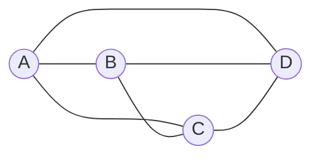
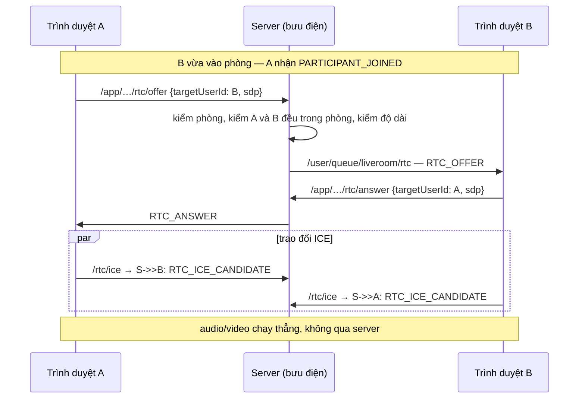

# Live Room — Gọi video (WebRTC)

> STOMP `/app/liveroom/{id}/rtc/{offer,answer,ice}` → `/user/queue/liveroom/rtc` · REST `GET /rooms/{id}/rtc/config`
> Bối cảnh: [Live Room — Tour](liveroom-00-tour.md) · Tầng vận chuyển: [13 — Realtime STOMP](13-realtime-stomp.md)

---

## 1. Bài toán, và điều backend **không** làm

WebRTC là kết nối **trực tiếp giữa hai trình duyệt**. Âm thanh và hình ảnh không đi qua server.

Nhưng hai trình duyệt không tự tìm được nhau. Chúng cần một bên trung gian chuyển hộ vài mẩu thông tin để bắt tay: mô tả phiên (SDP) và các ứng viên đường mạng (ICE candidate). Việc đó gọi là **signaling**, và đó là **toàn bộ** phần backend làm.

Nói cách khác: module này không xử lý audio/video một chút nào. Nó là một **bưu điện có kiểm tra giấy tờ**.

---

## 2. Kiến trúc mesh



Mỗi người kết nối trực tiếp tới **tất cả** những người còn lại. Với `n` người là `n(n-1)/2` kết nối.

| Số người | Số kết nối | Mỗi người gửi |
|---|---|---|
| 2 | 1 | 1 luồng |
| 4 | 6 | 3 luồng |
| **7** (mặc định) | **21** | **6 luồng** |

Đây chính là lý do sức chứa mặc định là **7**. Mesh không cần server media (SFU/MFU) — rẻ và đơn giản — nhưng mỗi người phải mã hoá và tải lên `n-1` luồng video. Quá bảy người thì đường lên của máy người dùng không chịu nổi, và không có cấu hình nào cảnh báo điều đó: sức chứa đặt được lớn hơn khi tạo phòng, và chất lượng sẽ tự xuống.

---

## 3. Tín hiệu đi kênh riêng của từng người — một lỗ hổng đã được vá

Thiết kế ban đầu định dùng `/topic/liveroom/{roomId}/rtc/{targetUserId}`. Cài đặt cuối dùng `/user/queue/liveroom/rtc`.

Vì sao đổi, và đây là bài học đáng nhớ nhất của file:

`StompSubscriptionScopeInterceptor` chỉ đọc **`roomId` ở đoạn đầu tiên** của destination để kiểm quyền ([13 §5.1](13-realtime-stomp.md)). Với dạng topic ở trên, một người trong phòng đăng ký `/topic/liveroom/{roomId}/rtc/{id-của-người-khác}` sẽ **qua được phép kiểm** — `roomId` đúng, và họ đúng là thành viên. Từ đó họ đọc được SDP và ICE candidate của người khác.

Điều này đã được **xác nhận bằng thử nghiệm**: lệnh subscribe thành công, chỉ là bây giờ nó không nhận được gì.

`/user/queue/**` định tuyến theo **principal của phiên**. Không ai đăng ký được hàng đợi của người khác — Spring dịch `/user/...` sang một đích riêng theo tên principal của chính người đăng ký.

> Điểm đáng học: cách chữa không phải là thêm một luật kiểm tra nữa, mà là **chọn một cơ chế an toàn theo cấu tạo**. Luật thì phải nhớ; cấu tạo thì không quên được.

Cùng lý do khiến `/user/` nằm trong danh sách prefix cấm client `SEND` ([13 §5.2](13-realtime-stomp.md)) — nếu không, ai cũng gửi được tín hiệu giả tới hàng đợi riêng của người khác.

---

## 4. Kiểm tra trước khi chuyển tiếp

```java
if (command.targetUserId() == null)                          throw … RTC_PAYLOAD_INVALID;
if (command.targetUserId().equals(command.actorId()))        throw … RTC_SELF_SIGNALING;
relayGuard.verify(command.roomId(), command.actorId(), command.targetUserId());
```

`RtcRelayGuard.verify` → `RoomSessions.requireRelayAllowed` kiểm **ba** điều:

```java
LiveRoom room = requireActiveRoom(roomId);     // phòng còn hoạt động
requireInRoom(room, actorId);                  // người gửi đang trong phòng
requireTargetInRoom(room, targetUserId);       // người nhận đang trong phòng
```

Điều kiện thứ ba dễ bị bỏ sót. Không có nó, một người trong phòng gửi tín hiệu được tới **bất kỳ userId nào trên hệ thống** — biến kênh RTC thành đường nhắn tin tuỳ ý tới người lạ.

Payload cũng bị chặn kích thước:

```java
if (sdp.length() > config.getRtc().getMaxSdpLength())                    throw … RTC_PAYLOAD_TOO_LARGE;
if (candidate.candidate().length() > config.getRtc().getMaxCandidateLength()) throw … RTC_PAYLOAD_TOO_LARGE;
```

**SDP ≤ 16384 ký tự, ICE candidate ≤ 1024.** Cần thiết vì server chuyển tiếp nguyên văn chuỗi này — không giới hạn thì nó thành kênh gửi dữ liệu tuỳ ý giữa hai người, ngoài mọi giới hạn của chat.

Backend **không phân tích SDP**. Nó chỉ kiểm không rỗng và không quá dài rồi chuyển đi. Đúng vai trò bưu điện: kiểm phong bì, không đọc thư.

---

## 5. Rate limit riêng cho RTC

Bucket `RTC`: **400 frame trong 10 giây** — cao hơn chat (15) hơn hai mươi lần ([13 §5.3](13-realtime-stomp.md)).

Không phải ưu ái, mà là bản chất của giao thức: một lần thương lượng ICE bắn ra hàng chục ứng viên trong vài giây, nhân với 6 người còn lại trong phòng 7 người. Đặt trần thấp là tự làm hỏng cuộc gọi ngay lúc mọi người vừa vào.

Đây là ví dụ rõ về việc **hạn mức phải khớp với hành vi thật của thứ nó bảo vệ**, không phải một con số chọn cho gọn.

---

## 6. Cấu hình ICE server

`GET /rooms/{id}/rtc/config` trả về danh sách STUN/TURN cho trình duyệt.

| | Vai trò | Cấu hình |
|---|---|---|
| **STUN** | Cho trình duyệt biết địa chỉ công khai của chính nó | `rtc.ice-servers`, mặc định có sẵn |
| **TURN** | Trung chuyển khi hai bên không nối trực tiếp được | `rtc.turn.enabled = false` |

TURN **mặc định tắt**. Hệ quả thực tế: hai người sau NAT đối xứng — mạng công ty, một số mạng di động — **sẽ không kết nối được**, và không có gì báo trước. Video đơn giản là không hiện.

Khi bật, `TurnCredentialFactory` sinh thông tin đăng nhập tạm thời với TTL **24 giờ** thay vì dùng mật khẩu TURN cố định. Máy chủ TURN tốn băng thông nên credential rò ra ngoài là hoá đơn của người khác.

---

## 7. Vòng đời một kết nối



Điểm khởi động là sự kiện `PARTICIPANT_JOINED` trên kênh phòng — client dùng nó để biết cần mở kết nối tới ai. `PARTICIPANT_LEFT` và `PARTICIPANT_KICKED` là tín hiệu đóng.

Nghĩa là **danh sách kết nối mesh do client tự dựng từ chuỗi sự kiện**. Server không giữ trạng thái nào về việc ai đang nối với ai — nó chỉ chuyển thư.

---

## 8. Quyết định & đánh đổi

| Quyết định | Thay vì | Vì sao | Cái giá |
|---|---|---|---|
| Mesh | SFU/MFU | Không cần server media, không tốn băng thông server | Không quá ~7 người; đường lên của người dùng gánh hết |
| Sức chứa mặc định 7 | Cao hơn | Đúng ngưỡng mesh còn chịu được | Đặt cao hơn được mà không có cảnh báo |
| `/user/queue`, không phải topic | Topic theo `targetUserId` | **An toàn theo cấu tạo**, không cần thêm luật kiểm | Không debug được bằng cách nghe lén một topic |
| Kiểm cả người nhận có trong phòng | Chỉ kiểm người gửi | Không biến RTC thành đường nhắn tới người lạ | Thêm một truy vấn mỗi frame |
| Giới hạn SDP/ICE | Chuyển nguyên xi | Không thành kênh truyền dữ liệu tuỳ ý | Có thể chặn nhầm SDP hợp lệ rất lớn |
| Không phân tích SDP | Kiểm tra nội dung | Bưu điện không đọc thư; đỡ phải theo kịp mọi phiên bản giao thức | Không chặn được nội dung SDP độc hại |
| RTC 400 frame / 10 giây | Cùng mức chat | ICE vốn bắn hàng loạt | Trần cao thì lọc được ít hơn |
| TURN mặc định tắt | Bật sẵn | TURN tốn tiền băng thông | Người sau NAT đối xứng **không gọi được**, im lặng |
| Credential TURN tạm 24 giờ | Mật khẩu cố định | Rò ra thì hết hạn | Client phải xin lại định kỳ |
| Server không giữ trạng thái mesh | Theo dõi ai nối với ai | Bưu điện không cần sổ | Không quan sát được sức khoẻ cuộc gọi từ server |

---

## 9. Tự kiểm chứng

```bash
T=$(curl -s -X POST http://localhost:8080/api/v1/auth/login -H "Content-Type: application/json" -d '{"email":"user1@gmail.com","password":"@NamHoang511"}' | grep -o '"accessToken":"[^"]*' | cut -d'"' -f4)
```

**Xem cấu hình ICE:**

```bash
curl -s "http://localhost:8080/api/v1/liveroom/rooms/<roomId>/rtc/config" -H "Authorization: Bearer $T"
```

Có STUN, và có TURN hay không tuỳ `rtc.turn.enabled`.

**Thử lỗ hổng cũ** — đây là thí nghiệm đáng làm nhất. Từ một client đang ở trong phòng, đăng ký:

```
/topic/liveroom/<roomId>/rtc/<userId-của-người-khác>
```

Lệnh **subscribe thành công** (interceptor chỉ đọc `roomId` ở đoạn đầu), nhưng **không nhận được frame nào** — vì server không còn phát vào đó. Đó chính là cách lỗ hổng ở mục 3 được vá.

Rồi thử đăng ký hàng đợi riêng của người khác — không có cú pháp nào làm được, `/user/**` luôn phân giải về chính bạn.

**Thử gửi tín hiệu cho người ngoài phòng** — gửi `/app/…/rtc/offer` với `targetUserId` là một người không có trong phòng. Nhận `PARTICIPANT_NOT_FOUND` trên `/user/queue/liveroom/errors`.

**Thử tự gửi cho mình** — `targetUserId` bằng chính mình. Nhận `RTC_SELF_SIGNALING`.

**Thử SDP quá dài** — gửi một chuỗi hơn 16384 ký tự. Nhận `RTC_PAYLOAD_TOO_LARGE`.

**Xem giao thông ICE thật** — mở hai trình duyệt vào cùng phòng, xem tab Network → WS. Số frame RTC trong vài giây đầu chính là lý do trần 400.

Trong Chrome mở `chrome://webrtc-internals` để xem kết nối thật đã lập chưa và đi qua STUN hay TURN.

---

## 10. Giới hạn hiện tại

| Giới hạn | Chi tiết |
|---|---|
| **Không quá ~7 người** | Bản chất mesh; sức chứa lớn hơn đặt được nhưng chất lượng tự xuống, không cảnh báo |
| TURN tắt → một số mạng không gọi được | Hỏng **im lặng**, không có thông báo cho người dùng — mục 6 |
| Không có chia sẻ màn hình | Chỉ camera và mic |
| Không ghi lại cuộc gọi | Media không qua server nên server không ghi được |
| Server không biết cuộc gọi có thành không | Không giữ trạng thái mesh; không đo được chất lượng |
| Không có dự phòng khi kết nối hỏng | Client tự xử lý; không có đường báo lại server |
| Không phân tích SDP | Mục 4 |
| Danh sách kết nối do client tự dựng | Client bỏ lỡ `PARTICIPANT_LEFT` sẽ giữ một kết nối chết |
